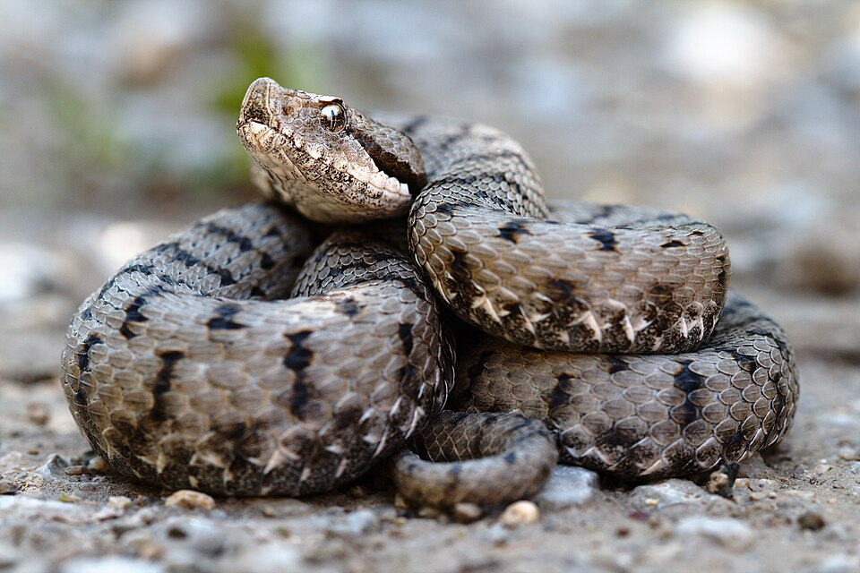

```{r, include=FALSE}
set.seed(42)
```

# Linear and linear mixed models

::: callout-note
In this chapter, we will discuss how to fit linear and linear mixed models in a Bayesian framework, using a dataset on body mass in the snake Vipera aspis as a running example. You will learn

- How to fit a Bayesian linear regression with a continuous predictor in brms and JAGS, and compare it to the frequentist `lm()` fit
- How to add categorical predictors and interactions to the model
- How to extend the model to a linear mixed model (LMM) with a random intercept, and compare it to `lmer()`
:::

## LM

To introduce the typical options in a linear model, we use an example that was originally prepared by Jörn Pagel. In the example, we want to analyze predictors of Body mass in the snake Vipera aspis.

[]((https://de.wikipedia.org/wiki/Aspisviper#/media/Datei:Vipera_aspis_aspis.jpg))

```{r}
Dat = read.table("https://raw.githubusercontent.com/florianhartig/LearningBayes/master/data/Aspis_data.txt", stringsAsFactors = T)

# Inspect relationship between body mass and total body length
plot(Dat$TL, Dat$BM,
     xlab = 'Total length [mm]',
     ylab = 'Body mass [g]')

# For the analysis we use log-transformed body masses
# and log-transformed and scaled total body length (TL)
plot(Dat$log_TL.sc, Dat$log_BM)
```

### LM with continuous predictor

Linear regression with lm()

```{r}
LM <- lm(log_BM ~ log_TL.sc, data = Dat)
summary(LM)
```

Analysis in brms

```{r, message = F, warning = F, results = 'hide'}
library(brms)
LMbrms <- brm(log_BM ~ log_TL.sc, data = Dat)
```

```{r}
summary(LMbrms)
```

Analysis in JAGS

```{r}
library(rjags)
model ="
model{
  # Likelihood
  for(i in 1:n.dat){
    y[i] ~ dnorm(mu[i],tau)
    mu[i] <- alpha + beta.TL * TL[i]
  }
  
  # Prior distributions
  alpha ~ dnorm(0,0.001)
  beta.TL ~ dnorm(0,0.001)
  tau <- 1/(sigma*sigma)
  sigma ~ dunif(0,100)
}
"

# 2) Set up a list that contains all the necessary data
Data = list(y = Dat$log_BM, 
            TL = Dat$log_TL.sc,
            n.dat = nrow(Dat))

# 3) Specify a function to generate inital values for the parameters
inits.fn <- function() list(alpha = rnorm(1), 
                            beta.TL = rnorm(1),
                            sigma = runif(1,1,100))

# Compile the model and run the MCMC for an adaptation (burn-in) phase
jagsModel <- jags.model(file = textConnection(model), 
                        data=Data, 
                        init = inits.fn, 
                        n.chains = 3, 
                        n.adapt= 5000)

# Specify parameters for which posterior samples are saved
para.names <- c("alpha","beta.TL","sigma")

# Continue the MCMC runs with sampling
Samples <- coda.samples(jagsModel, 
                        variable.names = para.names, 
                        n.iter = 5000)

# Statistical summaries of the (marginal) posterior 
# distribution for each parameter
summary(Samples)

# If we were interested only in point estimates,
# we could extract posterior means
PostMeans <- summary(Samples)$statistics[,'Mean']

# Graphical overview of the samples from the MCMC chains
plot(Samples)
```

Compare JAGS to the lm() results

```{r}
plot(Dat$log_TL.sc, Dat$log_BM)
coef(LM)
# and the two regression lines
abline(LM, col = 'red', lty = 3)
abline(PostMeans[1:2], col = 'blue', lty = 2)

```

### LM with categorical predictor

Inspect relationship between body mass and total body length but now separately for the two sexes

```{r}
point.symbols <- c(f = 1, m = 4)
plot(Dat$TL, Dat$BM,
     pch = point.symbols[Dat$Sex],
     xlab = 'Total length [mm]',
     ylab = 'Body mass [g]')

# For the analysis we use log-transformed body masses
# and log-transformed and scaled total body length (TL)
plot(Dat$log_TL.sc, Dat$log_BM, 
     pch = point.symbols[Dat$Sex])
```

Linear regression with lm()

```{r}
LM <- lm(log_BM ~ log_TL.sc + Sex, data = Dat)
summary(LM)
```

Analysis in brms

```{r, message = F, warning = F, results = 'hide'}
library(brms)
LMbrms <- brm(log_BM ~ log_TL.sc + Sex, data = Dat)
```

```{r}
summary(LMbrms)
```

Analysis in JAGS

```{r}
model = 
  "model{
  # Likelihood
  for(i in 1:n.dat){
    y[i] ~ dnorm(mu[i],tau)
    mu[i] <- alpha + beta.TL * TL[i] + beta.m * Sexm[i]
    }
  
  # Prior distributions
  alpha ~ dnorm(0,0.001)
  beta.TL ~ dnorm(0,0.001)
  beta.m ~ dnorm(0,0.001)
  tau <- 1/(sigma*sigma)
  sigma ~ dunif(0,100)
  }
  "

# 2) Set up a list that contains all the necessary data
Data = list(y = Dat$log_BM, 
            TL = Dat$log_TL.sc,
            Sexm = ifelse(Dat$Sex == 'm', 1, 0),
            n.dat = nrow(Dat))

# 3) Specify a function to generate inital values for the parameters
inits.fn <- function() list(alpha = rnorm(1), 
                            beta.TL = rnorm(1),
                            beta.m = rnorm(1),
                            sigma = runif(1,1,100))

# Compile the model and run the MCMC for an adaptation (burn-in) phase
jagsModel <- jags.model(file = textConnection(model), data=Data, 
                        init = inits.fn, n.chains = 3, 
                        n.adapt= 5000)

# Specify parameters for which posterior samples are saved
para.names <- c("alpha","beta.TL","beta.m","sigma")

# Continue the MCMC runs with sampling
Samples <- coda.samples(jagsModel, variable.names = para.names, 
                        n.iter = 5000)

# Statistical summaries of the (marginal) posterior distribution
# for each parameter
summary(Samples)

# Compare this to the lm() results
coef(LM)

# Graphical overview of the samples from the MCMC chains
plot(Samples)

# Check convergence
gelman.diag(Samples)

# Correlation plot
BayesianTools::correlationPlot(Samples)
```

### LM with interaction

From the previous plot, it's obvious that we could also consider an interaction between sex and body mass

Linear regression with lm()

```{r}
LM <- lm(log_BM ~ log_TL.sc + Sex + Sex:log_TL.sc, data = Dat)
summary(LM)
```

Analysis in JAGS

```{r}
model =
  "model{
  # Likelihood
  for(i in 1:n.dat){
    y[i] ~ dnorm(mu[i],tau)
    mu[i] <- alpha + beta.TL[Sex[i]] * TL[i] + beta.m * Sexm[i]
    }
  
  # Prior distributions
  alpha ~ dnorm(0,0.001)
  for(s in 1:2){
    beta.TL[s] ~ dnorm(0,0.001)
    }
  beta.m ~ dnorm(0,0.001)
  tau <- 1/(sigma*sigma)
  sigma ~ dunif(0,100)
  }
  "

# 2) Set up a list that contains all the necessary data
Data = list(y = Dat$log_BM, 
            TL = Dat$log_TL.sc,
            Sexm = ifelse(Dat$Sex == 'm', 1, 0),
            Sex = as.numeric(Dat$Sex),
            n.dat = nrow(Dat))

# 3) Specify a function to generate inital values for the parameters
inits.fn <- function() list(alpha = rnorm(1), 
                            beta.TL = rnorm(2),
                            beta.m = rnorm(1),
                            sigma = runif(1,1,100))

# Compile the model and run the MCMC for an adaptation (burn-in) phase
jagsModel <- jags.model(file = textConnection(model), data=Data, 
                        init = inits.fn, n.chains = 3, 
                        n.adapt= 5000)

# Specify parameters for which posterior samples are saved
para.names <- c("alpha","beta.TL","beta.m","sigma")

# Continue the MCMC runs with sampling
Samples <- coda.samples(jagsModel, variable.names = para.names, 
                        n.iter = 5000)

# Statistical summaries of the (marginal) posterior distribution
# for each parameter
summary(Samples)

# Compare this to the lm() results
coef(LM)

# Graphical overview of the samples from the MCMC chains
plot(Samples)

# Check convergence
gelman.diag(Samples)

# Correlation plot
BayesianTools::correlationPlot(Samples)
```

## LMM (mixed effects)

For motivation and principles of frequentist mixed effect models, see our [GLMM course](https://theoreticalecology.github.io/AdvancedRegressionModels/).

Standard model with lme4

```{r}
library(lme4)
LME <- lmer(log_BM ~ log_TL.sc + Sex + Sex:log_TL.sc
            + (1|Pop), data = Dat)
summary(LME)
```

Analysis in brms

```{r, message = F, warning = F, results = 'hide'}
library(brms)
LMEbrms <- brm(log_BM ~ log_TL.sc + Sex + Sex:log_TL.sc
            + (1|Pop), data = Dat)
```

```{r}
summary(LMEbrms)
```

Analysis in JAGS

```{r}
model = 
  "model{
  # Likelihood
  for(i in 1:n.dat){
    y[i] ~ dnorm(mu[i],tau)
    mu[i] <- alpha[Pop[i]] + beta.TL[Sex[i]] * TL[i] + beta.m * Sexm[i]
    }
  
  # Prior distributions
  for(p in 1:n.pop){
    alpha[p] ~ dnorm(mu.alpha, tau.pop)
    }
  for(s in 1:2){
    beta.TL[s] ~ dnorm(0,0.001)
  }
  mu.alpha ~ dnorm(0,0.001)
  beta.m ~ dnorm(0,0.001)
  tau <- 1/(sigma*sigma)
  sigma ~ dunif(0,100)
  tau.pop <- 1/(sigma.pop*sigma.pop)
  sigma.pop ~ dunif(0,100)
  }
  "

# 2) Set up a list that contains all the necessary data
Data = list(y = Dat$log_BM, 
            TL = Dat$log_TL.sc,
            Sexm = ifelse(Dat$Sex == 'm', 1, 0),
            Sex = as.numeric(Dat$Sex),
            n.dat = nrow(Dat),
            Pop = Dat$Pop,
            n.pop = max(Dat$Pop))

# 3) Specify a function to generate inital values for the parameters
inits.fn <- function() list(mu.alpha = rnorm(1), 
                            beta.TL = rnorm(2),
                            beta.m = rnorm(1),
                            sigma = runif(1,1,100),
                            sigma.pop = runif(1,1,100))

# Compile the model and run the MCMC for an adaptation (burn-in) phase
jagsModel <- jags.model(file = textConnection(model), data=Data, 
                        init = inits.fn, n.chains = 3, 
                        n.adapt= 5000)

# Specify parameters for which posterior samples are saved
para.names <- c("mu.alpha","beta.TL","beta.m","sigma","sigma.pop")

# Continue the MCMC runs with sampling
Samples <- coda.samples(jagsModel, variable.names = para.names, 
                        n.iter = 5000)

# Statistical summaries of the (marginal) posterior distribution
# for each parameter
summary(Samples)

# Compare this to the lmer() results
summary(LME)

# Graphical overview of the samples from the MCMC chains
plot(Samples)

# Check convergence
gelman.diag(Samples)

# Correlation plot
BayesianTools::correlationPlot(Samples)
```
