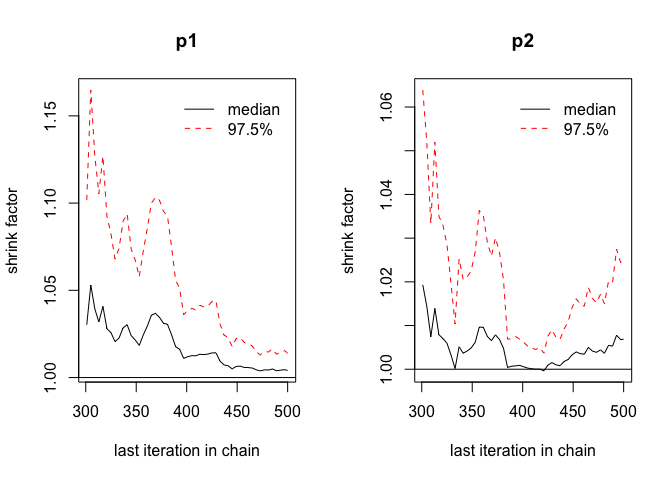
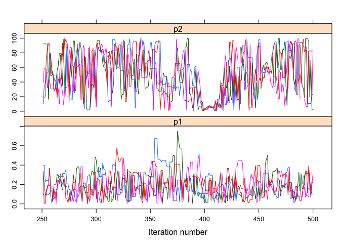
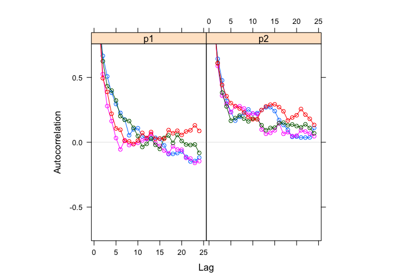
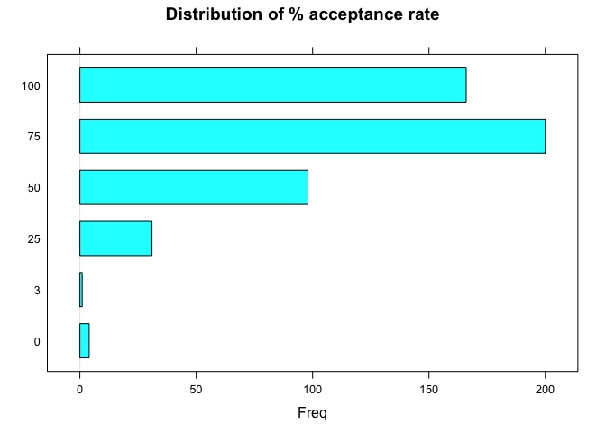
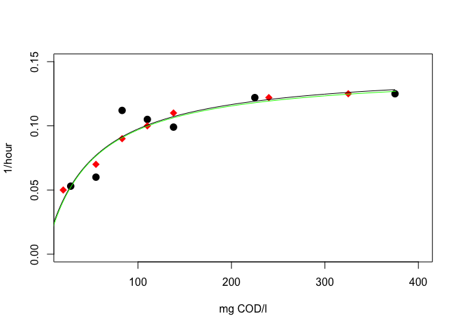

An example of the DREAM algorithm
===


## Background 

The DREAM algorithm was proposed in 

Vrugt, J. A., ter Braak, C. J. F., Diks, C. G. H., Robinson, B. A., Hyman, J. M., Higdon, D., 2009. Accelerating Markov chain Monte Carlo simulation by differential evolution with self-adaptive randomized subspace sampling. International Journal of Nonlinear Sciences and Numerical Simulation 10 (3), 273-290. DOI: 10.1515/IJNSNS.2009.10.3.273

and seems to be use quite a lot in hydroplogy. There is an R package http://dream.r-forge.r-project.org/, but apparently this was discontinued while still in a beta-phase. *I therefore can't guarantee that the sampler works fine*. Still, I thought it would be nice to have an example here, so I copied the code from the package from r-forge to here, and present one of the examples of the package. Everything that follows from is is a modified version from the **FME.nonlinear.model.R** in the package

### Loading the code 


```r
library(R.utils)
library(FME)
#library(hydromad)
sourceDirectory("./Dream_code/")
```

### Example 

We use an example from FME vignette, p21, section 7. Soetaert & Laine, Nonlinear model parameter estimation

http://r-forge.r-project.org/plugins/scmsvn/viewcvs.php/pkg/FME/inst/doc/FMEmcmc.Rnw?rev=96&root=fme&view=markup

The data that is provided is


```r
Obs <- data.frame(x=c(   28,  55,   83,  110,  138,  225,  375),   # mg COD/l
                  y=c(0.053,0.06,0.112,0.105,0.099,0.122,0.125))   # 1/hour
Obs2<- data.frame(x=c(   20,  55,   83,  110,  138,  240,  325),   # mg COD/l
                   y=c(0.05,0.07,0.09,0.10,0.11,0.122,0.125))   # 1/hour
obs.all <- rbind(Obs,Obs2)
```

### Fit the model via FME


```r
Model <- function(p,x) return(data.frame(x=x,y=p[1]*x/(x+p[2])))
##Model(c(0.1,1),obs.all$x)

Residuals  <- function(p) {
   cost<-modCost(model=Model(p,Obs$x),obs=Obs,x="x")
   modCost(model=Model(p,Obs2$x),obs=Obs2,cost=cost,x="x")
}

P      <- modFit(f=Residuals,p=c(0.1,1))
print(P$par)
```

```
## [1]  0.1448222 48.4323062
```

```r
plotFME <- function(){
plot(Obs,xlab="mg COD/l",ylab="1/hour", pch=16, cex=1.5,
     xlim=c(25,400),ylim=c(0,0.15))
points(Obs2,pch=18,cex=1.5, col="red")
lines(Model(p=P$par,x=0:375))
}
```


## Fit the model with DREAM


```r
Model.y <- function(p,x) p[1]*x/(x+p[2])
pars <- list(p1=c(0,1),p2=c(0,100))

control <- list(
                nseq=4
                )

set.seed(456)
dd <- dreamCalibrate(FUN=Model.y,
                     pars=pars,
                     obs=obs.all$y,
                     FUN.pars=list(x=obs.all$x),
                     control=control
                     )
```

```
## R.stats:
##  fun.evals        p1        p2
##   1000.000     1.017     1.038
##   2000.000     1.004     1.007
```

### Dream outputs


```r
print(dd)
```

```
## 
## Call:
## dreamCalibrate(FUN = Model.y, pars = pars, obs = obs.all$y, FUN.pars = list(x = obs.all$x), 
##     control = control)
## 
## Control:
##             nCR: 3 
##           gamma: 0 
##           steps: 10 
##             eps: 0.05 
##     outlierTest: IQR_test 
##      pCR.Update: TRUE 
##   boundHandling: reflect 
##   burnin.length: 10000 
##           ndraw: 1e+05 
##         maxtime: Inf 
##          Rthres: 1.01 
##          thin.t: NA 
##          REPORT: 1000 
##        parallel: none 
##            ndim: 2 
##         DEpairs: 1 
##            nseq: 4 
##              Cb: NA 
##              Wb: NA 
## 
## Exit condition: Convergence criteria reached
```

```r
print(summary(dd))
```

```
## 
## Exit message:  Convergence criteria reached
## Num fun evals: 2000
## Time (secs):   0.6
## Final R.stats:
## 	p1:	1.004073
## 	p2:	1.006873
## 
## CODA summary for last 50% of MCMC chains:
## 
## Iterations = 251:500
## Thinning interval = 1 
## Number of chains = 4 
## Sample size per chain = 250 
## 
## 1. Empirical mean and standard deviation for each variable,
##    plus standard error of the mean:
## 
##       Mean      SD Naive SE Time-series SE
## p1  0.1944  0.1211 0.003831        0.00908
## p2 50.5941 29.3128 0.926952        2.19122
## 
## 2. Quantiles for each variable:
## 
##       2.5%     25%     50%     75%   97.5%
## p1 0.01612  0.1013  0.1792  0.2812  0.4507
## p2 2.22068 27.7562 50.6519 77.2437 97.6402
## 
## 
## Acceptance Rate
##    Min. 1st Qu.  Median    Mean 3rd Qu.    Max. 
##    0.00   50.00   75.00   74.56  100.00  100.00 
##    Min. 1st Qu.  Median    Mean 3rd Qu.    Max. 
##    0.00   50.00   75.00   74.56  100.00  100.00
```

```r
print(coef(dd))
```

```
##         p1         p2 
##  0.1426957 46.8741551
```

```r
plot(dd)
```

     

```r
plotFME()
lines(predict(dd,
              newdata=list(x=0:375)),
      col="green")
```

 


## Compare likelihood function for coefficients obtained by dream and FME modfit


```r
dd$lik.fun(coef(dd))
```

```
## [1] -0.003313129
```

```r
dd$lik.fun(P$par)
```

```
## [1] -0.0032852
```

