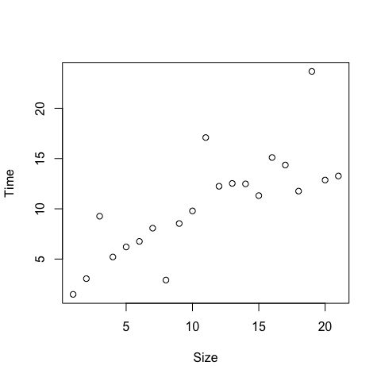
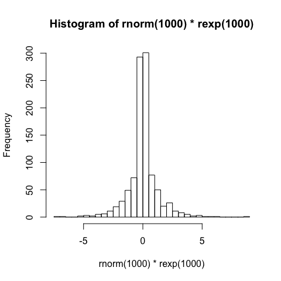
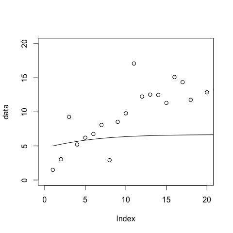
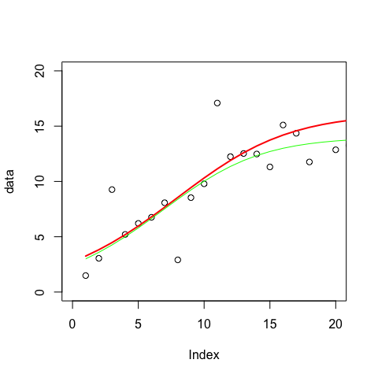
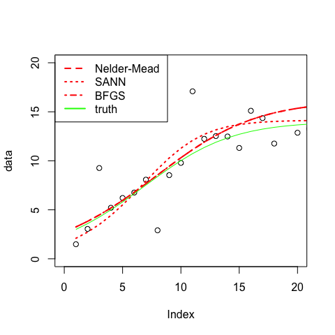
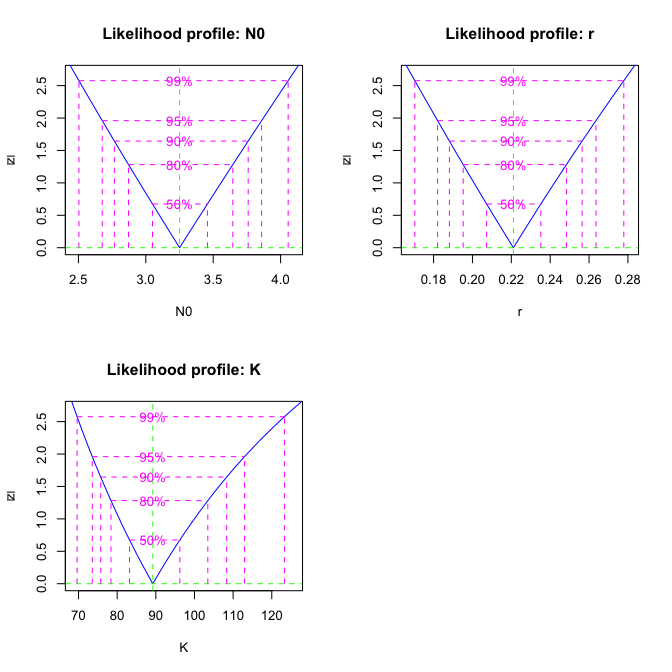
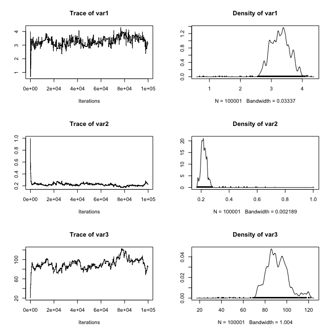
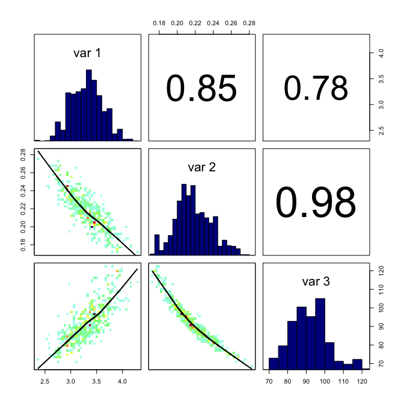
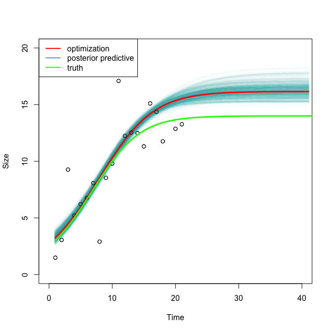

# Fitting Process Models to Data
Florian Hartig  
30 Jul 2014  


## The model 

Assume we want to fit a growth model to data. I am choosing here a logistic model for simplicty, but any other option would be fine as well. 


```r
model <- function (N0 = 3, r=0.2, K=50, timesteps = 20){
  
  popdyn <- c(N0, rep(NA, timesteps))
  for (i in 1:timesteps){
    popdyn[i+1] <- popdyn[i] * (r+1) * (1 - popdyn[i] / K) 
  }
  return(popdyn)          
}
```

## The data 

For convenience, I create our data simply from the model and add some noise 


```r
truth <- model(r = 0.25, K = 70, timesteps=100) 
data <- truth[1:21] + 2 * rnorm(21) * rexp(21)
plot(data, xlab = "Time", ylab ="Size")
lines(truth, col = "green")
```

 

For the noise, I have deliberately chosen not a normal distribution, but something that has more heavy tails to get a few "outliers".

```r
hist(rnorm(1000) * rexp(1000), breaks = 50)
```

 

## Objective function

In this case, we know of course the true parameters, but in any realistic situation we wouldn't. Hence, we need to be able to compare different parameterizations to the data. 

The way this is typically done is to specify an objective function that quantifies how strongly a prediction deviates from the data. Need sumthing that calculates for us the difference between the data that we want to use to fit the model, and the model results 


```r
objective <- function(x){
  
  NO = x[1]
  r = x[2]
  K = x[3]
  
  difference = (data - model(NO, r, K, 20))^2
  return(sum(difference))
}
```


## Optimization 

To get a feeling for the problem, why not try optimization by hand before going to the optimizers? Take the code below and change the parameters!


```r
plot(data, xlim = c(0,20), ylim = c(0,20))

objective(c(5,0.2,40))
```

```
## [1] 837.6219
```

```r
lines(model(5,0.2,40), col = 1)
```

 

OK, here comes the systematic optimization algorithm 


```r
optimfit <- optim(c(1,1.3,40), objective, method = "Nelder-Mead")

optimfit
```

```
## $par
## [1]  3.2518435  0.2209815 89.2718552
## 
## $value
## [1] 196.4886
## 
## $counts
## function gradient 
##      366       NA 
## 
## $convergence
## [1] 0
## 
## $message
## NULL
```

```r
# plotting the results

plot(data, xlim = c(0,20), ylim = c(0,20), xlab = "Time", ylab ="Size")

lines(model(optimfit$par[1], optimfit$par[2], optimfit$par[3], 40), col = "red", lwd = 2)

lines(truth[1:21], col = "green")
```

 

Look at the help in optim and change the optimization algorithm. Do the results stay the same?


```r
plot(data, xlim = c(0,20), ylim = c(0,20), xlab = "Time", ylab ="Size")

optimfit <- optim(c(1,1.3,40), objective, method = "Nelder-Mead")
lines(model(optimfit$par[1], optimfit$par[2], optimfit$par[3], 40), col = "red", lwd = 2, lty = 2)

optimfit <- optim(c(1,1.3,40), objective, method = "SANN")
lines(model(optimfit$par[1], optimfit$par[2], optimfit$par[3], 40), col = "red", lwd = 2, lty = 3)

optimfit <- optim(c(1,1.3,40), objective, method = "BFGS")
lines(model(optimfit$par[1], optimfit$par[2], optimfit$par[3], 40), col = "red", lwd = 2, lty = 4)

lines(truth[1:21], col = "green")

legend("topleft", c("Nelder-Mead", "SANN", "BFGS", "truth"), lty = c(2:4, 1), lwd = 2, col = c("red", "red","red", "green"))
```

 


### Uncertainty around the optimum 

We can get a basic estimate of the uncertainty around the optimum by looking at the hessian, which is calculated by the optim function 


```r
optimfit <- optim(c(1,1.3,40), objective, hessian = T)
optimfit$hessian
```

```
##             [,1]        [,2]        [,3]
## [1,]   60.750466   1973.5819   2.6622494
## [2,] 1973.581923 120983.6894 206.4619345
## [3,]    2.662249    206.4619   0.3806677
```
Larger values indicate stronger uncertainty / correlation. If we want to plot the goodness-of-fit across parameters, we have two three options 

1. Change a parameter while the other parameters remain on the value given by the global optimum 
2. Change a parameter while the other parameters are adjusted 
3. Change a parameter while the other parameters take any other values, proportional to their goodness of fit

I don't think these options have a general name. In a statistical context where you optimize the likelihood, 1. is callded marginal likelihood, 2. is called profile likelihood, and 3 is called the marginal distribution (see later). 

Option 1 is conveniently done by the bblme package.


```r
library(bbmle)
```

```
## Loading required package: stats4
```

```r
objective2 <- function(N0, r, K) objective(c(N0,r,K))
fit <- mle2(objective2,list(N0=1,r=1.3,K=40))
plot(profile(fit))
```

 

```r
vcov(fit)
```

```
##              N0             r          K
## N0  0.091068320 -0.0053574592  2.2660916
## r  -0.005357459  0.0004262682 -0.1934973
## K   2.266091561 -0.1934972654 91.6170293
```

```r
cov2cor(vcov(fit))
```

```
##            N0          r          K
## N0  1.0000000 -0.8598719  0.7845230
## r  -0.8598719  1.0000000 -0.9791411
## K   0.7845230 -0.9791411  1.0000000
```

Note that the percentages don't have a meaning only if the objective function is the lieklihood. 

For option 3, see MCMC sampling below. I leave out option 2. 


### More powerful optimization algorithms in R

* optimx: A Replacement and Extension of the optim() Function http://cran.r-project.org/web/packages/optimx/index.html

* DEoptim: Global Optimization by Differential Evolution http://cran.r-project.org/web/packages/DEoptim/index.html

* CRAN Task view optimization with a lot more packages http://cran.r-project.org/web/views/Optimization.html 


## Global view on the shape of the objective function via MCMC

A disadvantage of optimization is that we don't get a global view of the objective function that we optimize, 


```r
library(coda)
```

```
## Warning: package 'coda' was built under R version 3.1.3
```

```r
proposalfunction <- function(param){
  return(rnorm(3,mean = param, sd= c(1,0.2,3)))
}

run_metropolis_MCMC <- function(startvalue, iterations){
  chain = array(dim = c(iterations+1,3))
  chain[1,] = startvalue
  for (i in 1:iterations){
    proposal = proposalfunction(chain[i,])
    
    probab = exp(-objective(proposal) + objective(chain[i,]))
    
    if (runif(1) < probab){
      chain[i+1,] = proposal
    }else{
      chain[i+1,] = chain[i,]
    }
  }
  return(mcmc(chain))
}
```

Let's run the algorithm 


```r
startvalue = c(4,1,20)
chain = run_metropolis_MCMC(startvalue, 100000)
```

Plotting the development in the chain an the marginal parameter distributions


```r
plot(chain)
```

 

### Correlations between parameters 


To see correlations between parameters, we have to do a bit more. I'm loading a function from me to have a better plotting option. You need the 


```r
library(devtools)
source_url('https://raw.githubusercontent.com/florianhartig/LearningBayes/master/CommentedCode/02-Samplers/Analysis/MCMC_PlottingOptions.r')
```

```
## SHA-1 hash of file is b821f661afc096c03f373cfa94ff1642e384e961
## Loading required package: grid
## Loading required package: lattice
```


```r
#For plotting run 
burnIn = 10000
betterPairs(chain[-(1:burnIn),])
```

 


### Forwarding of the parametric uncertainty to our predictions 


```r
plot(data, xlim = c(0,40), ylim = c(0,20), xlab = "Time", ylab ="Size")

for (i in 1:1000){
  
  pars = chain[10000+90*i,]
  
  lines(model(pars[1], pars[2], pars[3], 40), col="#73A9D803", lwd = 4)
  
}

lines(model(optimfit$par[1], optimfit$par[2], optimfit$par[3], 40), col = "red", lwd = 3)
points(data)
lines(truth, col = "green", lwd = 3)


legend("topleft", c("optimization", "posterior predictive", "truth"), lwd = 2, col = c("red", "#73A9D8", "green"))
```

 


### Exercises

Run the code until the different optimization algorithms

1. Make sure you understand what we are doing 
2. Change the objective function and compare
3. Change the optimization algorithm and compare


---
**Copyright, reuse and updates**: By Florian Hartig. Updates will be posted at https://github.com/florianhartig/LearningBayes. Reuse permitted under Creative Commons Attribution-NonCommercial-ShareAlike 4.0 International License
