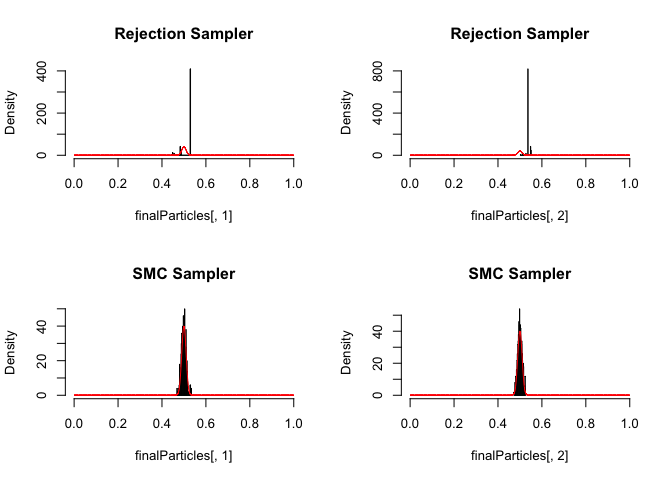

# SMC Sampling
FlorianHartig  


### Overview

SMC sampling is an extension of rejection sampling (see script about rejection sampling) that deals with a particular problem of rejection samplign, which is that a simple rejection sampler discards a large number of model evaluations when the area of non-vanising posterior density is very small compared to the prior volume

### How it works

Similar to rejection sampling, we start with an initial sample of parameters, calculate the likelihood, and then remove parameters according to their likelihood / posterior.

### An example in R

Assume we want to sample from a narrow, 2-dim normal distribution with mean 0.5,0.5


```r
likelihood <- function(x) sum(dnorm(x,0.5, 0.01, log = T))
```

Assume our prior is unifor from 0 to 1. 


```r
prior = function(x)sum(dunif(x,0,1))
```

Start with a random sample from the prior 


```r
initialParticles <- matrix(runif(1000,0,1), ncol = 2)
```

Now comes the SMC. The idea is to

1. Particles drawn from the prior, if we do nothing or likelihood flat it just stays prior (could generalize this to other starting distributions)
2. For N steps do
  1. Calculate Likelihood L for the particles
  2. Select particles for next step with probability L^(1/N) (to compensate for the several steps)
  3. Add a Metropolis-Hastings resampling step to avoid particle depletion / starvation (ending up with very few identical particles)


```r
smc_sampler <- function(likelihood, prior, initialParticles, iterations =1, resampling = T){
 
  particles <- initialParticles
 
  numPar <- ncol(initialParticles)
 
  for (i in 1:iterations){
    
    likelihoodValues <- apply(particles, 1, likelihood)
    
    relativeL = exp(likelihoodValues - max(likelihoodValues, na.rm = T))^(1/iterations) # dividing max to avoid numerical problems, no effect on the relative probabilities
    
    sel = sample.int(n=length(likelihoodValues), size = length(likelihoodValues), replace = T, prob = relativeL)
    
    particles = particles[sel,]
   
    if (resampling == T){
       
      proposal <- function(x) rnorm(length(x), mean = x, sd = 0.005)
   
      particlesProposals = t(apply(particles, 1, proposal))
   
      particlesProposalsLikelihood <- apply(particlesProposals, 1, likelihood)
 
      jumpProb <- exp(particlesProposalsLikelihood - likelihoodValues[sel])^(i/iterations) * exp(prior(particlesProposals) - prior(particles))
      accepted <- jumpProb > runif(length(particlesProposalsLikelihood), 0 ,1)
     
      particles[accepted, ] = particlesProposals[accepted, ]
    }
   
  }
  return(particles )
}
```

Plot the result


```r
par(mfrow = c(2,2))

finalParticles <- smc_sampler(likelihood, prior, initialParticles, iterations = 1, resampling = F)
hist(finalParticles[,1], freq = F, col = "grey", breaks = 50, xlim = c(0,1), main = "Rejection Sampler")
curve(dnorm(x,0.5, 0.01),0,1, n = 5000, add =T, col = "red")
hist(finalParticles[,2], freq = F, col = "grey", breaks = 50, xlim = c(0,1), main = "Rejection Sampler")
curve(dnorm(x,0.5, 0.01),0,1, n = 5000, add =T, col = "red")


finalParticles <- smc_sampler(likelihood, prior, initialParticles, iterations = 50)
hist(finalParticles[,1], freq = F, col = "grey", breaks = 50, xlim = c(0,1), main = "SMC Sampler")
curve(dnorm(x,0.5, 0.01),0,1, n = 5000, add =T, col = "red")
hist(finalParticles[,2], freq = F, col = "grey", breaks = 50, xlim = c(0,1), main = "SMC Sampler")
curve(dnorm(x,0.5, 0.01),0,1, n = 5000, add =T, col = "red")
```

 

