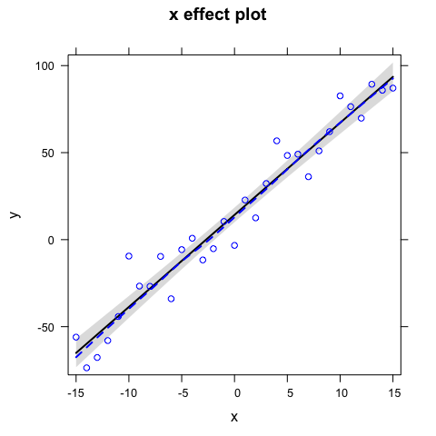
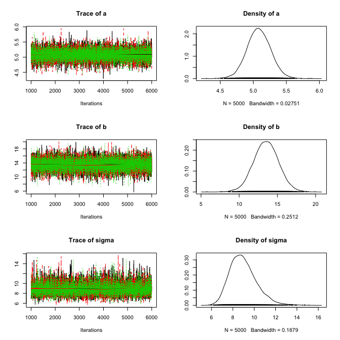

# Linear regression with Jags
Florian Hartig  
30 Jul 2014  

Based on an example provided by Jörn Pagel. 


## Creation of test data


```r
a <- 5
b <- 10
sigma <- 10

x <- -15:15
y <- a * x + b + rnorm(31,0,sd = sigma)
plot(x,y)
```

 

## Non-Bayesian analysis of this model


```r
fit <- lm(y ~ x)
summary(fit)
```

```
## 
## Call:
## lm(formula = y ~ x)
## 
## Residuals:
##      Min       1Q   Median       3Q      Max 
## -17.5911  -6.6283   0.0952   4.0020  21.9617 
## 
## Coefficients:
##             Estimate Std. Error t value Pr(>|t|)    
## (Intercept)   8.3426     1.6646   5.012 2.45e-05 ***
## x             4.9925     0.1861  26.826  < 2e-16 ***
## ---
## Signif. codes:  0 '***' 0.001 '**' 0.01 '*' 0.05 '.' 0.1 ' ' 1
## 
## Residual standard error: 9.268 on 29 degrees of freedom
## Multiple R-squared:  0.9613,	Adjusted R-squared:  0.9599 
## F-statistic: 719.6 on 1 and 29 DF,  p-value: < 2.2e-16
```

```r
plot(allEffects(fit, partial.residuals = T))
```

 


## Bayesian analysis of this model (in Jags)


```r
  # 1) Model definition exactly how we created our data 
  modelCode = textConnection("
    model{
      # Likelihood
      for(i in 1:i.max){
      y[i] ~ dnorm(mu[i],tau)
      mu[i] <- a*x[i] + b
      }
      # Prior distributions
      a ~ dnorm(0,0.001)
      b ~ dnorm(0,0.001)
      tau <- 1/(sigma*sigma)
      sigma ~ dunif(0,100)
    }
  ")
  
  # 2) Set up a list that contains all the necessary data (here, including parameters of the prior distribution)
  Data = list(y = y, x = x, i.max = length(y))

  # 3) Specify a function to generate inital values for the parameters
  inits.fn <- function() list(a = rnorm(1), b = rnorm(1), sigma = runif(1,1,100))
```

Running the model


```r
  # Compile the model and run the MCMC for an adaptation (burn-in) phase
  jagsModel <- jags.model(file= modelCode, data=Data, init = inits.fn, n.chains = 3, n.adapt= 1000)
```

```
## Compiling model graph
##    Resolving undeclared variables
##    Allocating nodes
##    Graph Size: 134
## 
## Initializing model
```

```r
  # Specify parameters for which posterior samples are saved
  para.names <- c("a","b","sigma")

  # Continue the MCMC runs with sampling
  Samples <- coda.samples(jagsModel, variable.names = para.names, n.iter = 5000)
  
  # Plot the mcmc chain and the posterior sample for p
  plot(Samples)
```

 

convergence check


```r
gelman.diag(Samples)
```

```
## Potential scale reduction factors:
## 
##       Point est. Upper C.I.
## a              1          1
## b              1          1
## sigma          1          1
## 
## Multivariate psrf
## 
## 1
```


```r
summary(Samples)
```

```
## 
## Iterations = 1001:6000
## Thinning interval = 1 
## Number of chains = 3 
## Sample size per chain = 5000 
## 
## 1. Empirical mean and standard deviation for each variable,
##    plus standard error of the mean:
## 
##        Mean     SD Naive SE Time-series SE
## a     4.994 0.1953 0.001595       0.001561
## b     8.296 1.7501 0.014289       0.014408
## sigma 9.699 1.3669 0.011161       0.016218
## 
## 2. Quantiles for each variable:
## 
##        2.5%   25%   50%    75%  97.5%
## a     4.606 4.864 4.995  5.122  5.372
## b     4.870 7.150 8.287  9.457 11.726
## sigma 7.481 8.726 9.551 10.489 12.838
```

predictions (not very elegant)


```r
plot(x,y)
sampleMatrix <- as.matrix(Samples)
selection <- sample(dim(sampleMatrix)[1], 1000)
for (i in selection) abline(sampleMatrix[i,1], sampleMatrix[i,1], col = "#11111105")
```

 


---
**Copyright, reuse and updates**: By Florian Hartig. Updates will be posted at https://github.com/florianhartig/LearningBayes. Reuse permitted under Creative Commons Attribution-NonCommercial-ShareAlike 4.0 International License
