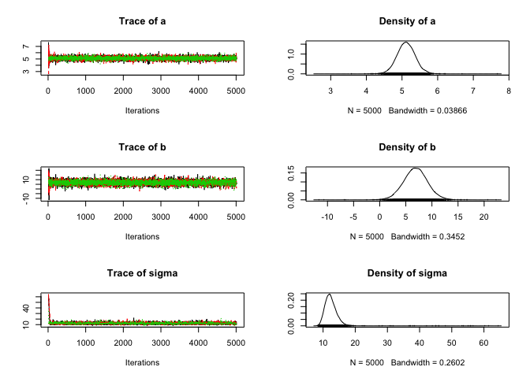

# Linear regression with Jags
Florian Hartig  
30 Jul 2014  

Based on an example provided by Jörn Pagel. 


## Creation of test data


```r
a <- 5
b <- 10
sigma <- 10

x <- -15:15
y <- a * x + b + rnorm(31,0,sd = sigma)
```


## Definition of the model in Jags


```r
  # 1) Model definition exactly how we created our data 
  modelCode = textConnection("
    model{
      # Likelihood
      for(i in 1:i.max){
      y[i] ~ dnorm(mu[i],tau)
      mu[i] <- a*x[i] + b
      }
      # Prior distributions
      a ~ dnorm(0,0.001)
      b ~ dnorm(0,0.001)
      tau <- 1/(sigma*sigma)
      sigma ~ dunif(0,100)
    }
  ")
  
  # 2) Set up a list that contains all the necessary data (here, including parameters of the prior distribution)
  Data = list(y = y, x = x, i.max = length(y))

  # 3) Specify a function to generate inital values for the parameters
  inits.fn <- function() list(a = rnorm(1), b = rnorm(1), sigma = runif(1,1,100))
```

Running the model


```r
  # Compile the model and run the MCMC for an adaptation (burn-in) phase
  jagsModel <- jags.model(file= modelCode, data=Data, init = inits.fn, n.chains = 3, n.adapt= 10)
```

```
## Compiling model graph
##    Resolving undeclared variables
##    Allocating nodes
##    Graph Size: 134
## 
## Initializing model
```

```
## Warning in jags.model(file = modelCode, data = Data, init = inits.fn,
## n.chains = 3, : Adaptation incomplete
```

```r
  # Specify parameters for which posterior samples are saved
  para.names <- c("a","b","sigma")

  # Continue the MCMC runs with sampling
  Samples <- coda.samples(jagsModel, variable.names = para.names, n.iter = 5000)
```

```
## NOTE: Stopping adaptation
```

```r
  # Plot the mcmc chain and the posterior sample for p
  plot(Samples)
```

 

convergence check


```r
gelman.diag(Samples)
```

```
## Potential scale reduction factors:
## 
##       Point est. Upper C.I.
## a              1          1
## b              1          1
## sigma          1          1
## 
## Multivariate psrf
## 
## 1
```


```r
summary(Samples)
```

```
## 
## Iterations = 11:5010
## Thinning interval = 1 
## Number of chains = 3 
## Sample size per chain = 5000 
## 
## 1. Empirical mean and standard deviation for each variable,
##    plus standard error of the mean:
## 
##         Mean     SD Naive SE Time-series SE
## a      5.114 0.2569 0.002098       0.002086
## b      6.854 2.3114 0.018872       0.018872
## sigma 12.508 2.7859 0.022747       0.114334
## 
## 2. Quantiles for each variable:
## 
##        2.5%    25%    50%    75%  97.5%
## a     4.617  4.946  5.113  5.281  5.624
## b     2.359  5.357  6.861  8.343 11.392
## sigma 9.533 11.164 12.191 13.415 16.441
```

