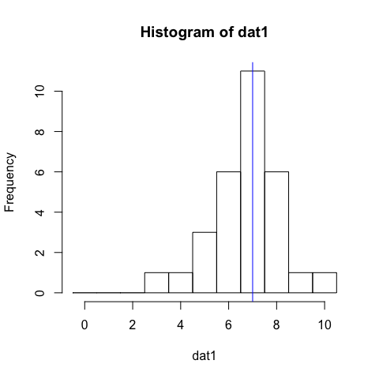
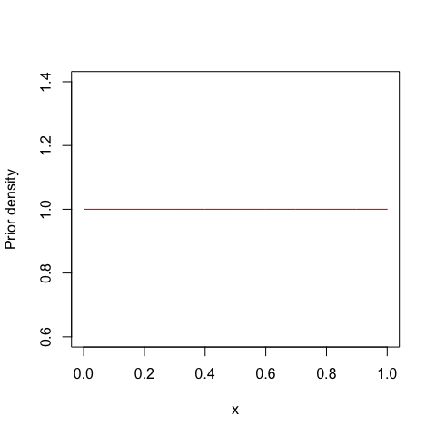
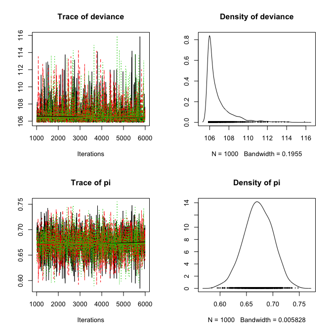
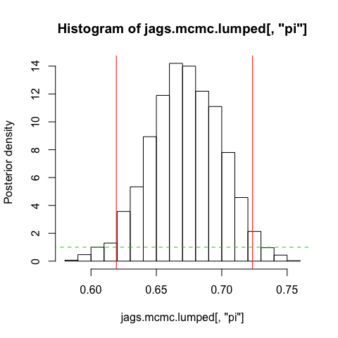
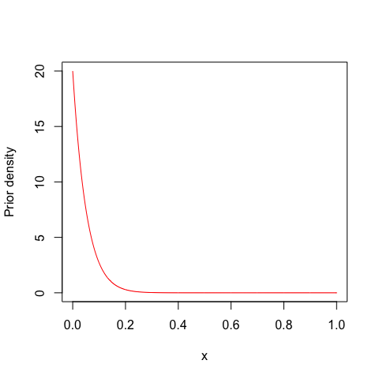
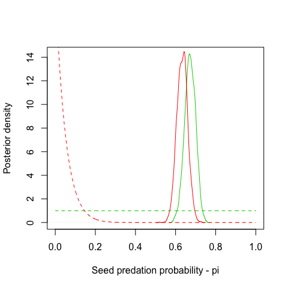

# Bayesian analysis of binomially distributed data
Felix May  
Friday, June 19, 2015  


```r
knitr::opts_chunk$set(fig.width=5, fig.height=5)
```

***

In this example we estimate the probability parameter (pi) of a binomial distribution. 
We use simulated data that represents the results of a simple seed predation experiment.

### 1. Simulate data

We assume there were 30 seed trays and 10 seeds per tray. The true seed predation probability is set to 0.7 (= 70%).


```r
set.seed(12345) # just for reproducability of the results. 

pi.true <- 0.7 # seed predation probability
N <- 10        # number of seeds per seed tray

dat1 <- rbinom(n=30,size=N,prob=pi.true) 
```

Now we visualize the results as histogram and add the "true" value as vertical line.


```r
hist(dat1,breaks=seq(-0.5,10.5,by=1))
summary(dat1)
```

```
##    Min. 1st Qu.  Median    Mean 3rd Qu.    Max. 
##   3.000   6.000   7.000   6.733   7.750  10.000
```

```r
abline(v=pi.true*N,col="blue")
```



### 2. Bayesian analysis using JAGS

First we have to code the model in the BUGS language. The model has to include the likelihood and priors for all parameters.
Here, we us a beta-distribution as prior for the seed predation probability (pi). The beta-distribution is highly flexible in shape and always restricted to the interval [0,1].  
As we have proportion data, we use a binomial distribution in the likelihood.


```r
modelCode <- "
   model{
      # Likelihood
      for(i in 1:n.max){
         y[i] ~ dbin(pi,N.total)
      }
      # Prior distributions
      pi ~ dbeta(1,1) # beta distribution
   }
"
```

If you do not know how the beta-distribution looks like, you should explore it:


```r
x <- seq(0,1,0.001)
plot(x,dbeta(x,shape1=1,shape2=1),col=2,type="l",ylab="Prior density")
```



The beta-distribution with a=1 and b=1 equals the uniform distribution with min=0 and max=1. But as you will see later te beta-distribution is much more flexible.


To compile the model and run the MCMC sampling in JAGS we need two important preparation steps. First we need to assign the variables from the R workspace to the variable names in the JAGS model. Carefully check the variable names in your data and in the model code! The assignment needs to be stored as a list.


```r
Data = list(y = dat1, N.total=N,n.max = length(dat1))
```

Second, we need to provide starting values (or a function that generated starting values) for the MCMC sampling. This also needs to be a list of lists -- one list for reach Markov chain.


```r
Inits = list(list("pi"=0.1),list("pi"=0.9),list("pi"=0.5))
```

We use the package R2jags for linking R and JAGS

```r
library(R2jags)
```

```
## Warning: package 'coda' was built under R version 3.1.3
```

Now we finally start the MCMC sampling in JAGS. In this call we need to hand over the data, the initial values, the parameters we want to sample, the model code, the number of chains, the number of iterations, the number of burnin samples (that is thrown away) and the thinning rate.


```r
jags.fit <- jags(data=Data, 
                 inits=Inits, 
                 parameters.to.save=c("pi"), 
                 model.file=textConnection(modelCode),
                 n.chains=3, 
                 n.iter=6000,
                 n.burnin=1000,
                 n.thin=5)
```

```
## module glm loaded
```

```
## Compiling model graph
##    Resolving undeclared variables
##    Allocating nodes
##    Graph Size: 34
## 
## Initializing model
```

We explore the model output using graphics and numeric output. In addition to the parameter "pi", we also get output on the "deviance". This is related to the log-likelihood, but we usually only use it in model comparisons. So it is of minor importance here.


```r
plot(jags.fit)
```


```r
print(jags.fit)
```

```
## Inference for Bugs model at "5", fit using jags,
##  3 chains, each with 6000 iterations (first 1000 discarded), n.thin = 5
##  n.sims = 3000 iterations saved
##          mu.vect sd.vect    2.5%     25%     50%     75%   97.5%  Rhat
## pi         0.672   0.027   0.619   0.654   0.672   0.692   0.723 1.001
## deviance 106.871   1.389 105.856 105.959 106.332 107.185 111.156 1.001
##          n.eff
## pi        3000
## deviance  3000
## 
## For each parameter, n.eff is a crude measure of effective sample size,
## and Rhat is the potential scale reduction factor (at convergence, Rhat=1).
## 
## DIC info (using the rule, pD = var(deviance)/2)
## pD = 1.0 and DIC = 107.8
## DIC is an estimate of expected predictive error (lower deviance is better).
```

The coda-package offers many functions for analysing output of a Bayesian analysis. Therefore, we convert the JAGSoutput to an mcmc-object that is compatible with the coda function.


```r
library(coda)
jags.mcmc <- as.mcmc(jags.fit)
```

Plotting this mcmc-object provides traceplots for all chains, which is useful to visually assess convergence, and the posterior distributions for each parameter.


```r
plot(jags.mcmc)  
```



We get numeric output with the following command.

```r
summary(jags.mcmc) 
```

```
## 
## Iterations = 1001:5996
## Thinning interval = 5 
## Number of chains = 3 
## Sample size per chain = 1000 
## 
## 1. Empirical mean and standard deviation for each variable,
##    plus standard error of the mean:
## 
##              Mean      SD  Naive SE Time-series SE
## deviance 106.8714 1.38941 0.0253671       0.025374
## pi         0.6724 0.02727 0.0004979       0.000498
## 
## 2. Quantiles for each variable:
## 
##              2.5%      25%      50%      75%    97.5%
## deviance 105.8561 105.9594 106.3318 107.1852 111.1559
## pi         0.6188   0.6541   0.6724   0.6916   0.7233
```

The most important numeric convergence cirterion is the Gelman-Rubin R-hat value. It indicates convergence if the R-hat value is close to one, which is the case here.


```r
gelman.diag(jags.mcmc) 
```

```
## Potential scale reduction factors:
## 
##          Point est. Upper C.I.
## deviance          1       1.01
## pi                1       1.00
## 
## Multivariate psrf
## 
## 1
```

Finally, we calculate the 95% interval of the "highest posterior density" (HPD). Please note that this can be different from the 9% Bayesian credible interval that you find between the 2.5% and 97.5% quantiles of the posterior distribution. Here we get one interval per chain.


```r
HPDinterval(jags.mcmc)
```

```
## [[1]]
##               lower       upper
## deviance 105.854707 109.8052072
## pi         0.617391   0.7235014
## attr(,"Probability")
## [1] 0.95
## 
## [[2]]
##                lower       upper
## deviance 105.8547100 109.5089576
## pi         0.6200473   0.7220129
## attr(,"Probability")
## [1] 0.95
## 
## [[3]]
##                lower       upper
## deviance 105.8547079 109.5380116
## pi         0.6222463   0.7247701
## attr(,"Probability")
## [1] 0.95
```

For further analysis it can be helpful to lump the samples from the three chains:


```r
jags.mcmc.lumped <- as.mcmc(rbind(jags.mcmc[[1]],jags.mcmc[[2]],jags.mcmc[[3]]))
```

We plot the posterior distribution of the lumped chains and add the highest-posterior density interval for all chains as well as the prior.


```r
hist(jags.mcmc.lumped[,"pi"],freq=F,ylab="Posterior density")
abline(v=HPDinterval(jags.mcmc.lumped[,"pi"]),col="red")
lines(x,dbeta(x,shape1=1,shape2=1),col=3,lty=2)
```



*********************************************

### 3. Exercise: Changing the prior

As an exercise we change the prior and assess how the posterior distribution changes. I use a beta distribution with a=1 and b=2 here. This means I assume there is low seed predation in my study area.


```r
plot(x,dbeta(x,shape1=1,shape2=20),col=2,type="l",ylab="Prior density")
```



With the new prior, we need to change the model code:


```r
modelCode2 = "
   model{
      # Likelihood
      for(i in 1:n.max){
         y[i] ~ dbin(pi,N.total)
      }
      # Prior distributions
      pi ~ dbeta(1,20)
   }
"
```

And compile the model and run the sampling again:


```r
jags.fit2 <- jags(data=Data, 
                 inits=Inits, 
                 parameters.to.save=c("pi"), 
                 model.file=textConnection(modelCode2),
                 n.chains=3, 
                 n.iter=6000,
                 n.burnin=1000,
                 n.thin=5)
```

```
## Compiling model graph
##    Resolving undeclared variables
##    Allocating nodes
##    Graph Size: 35
## 
## Initializing model
```


Now we compare the output of the first and second models and we will find that the posterior distribution was shifted to lower values of the seed predation probability.


```r
jags.mcmc2 <- as.mcmc(jags.fit2)

summary(jags.mcmc)
```

```
## 
## Iterations = 1001:5996
## Thinning interval = 5 
## Number of chains = 3 
## Sample size per chain = 1000 
## 
## 1. Empirical mean and standard deviation for each variable,
##    plus standard error of the mean:
## 
##              Mean      SD  Naive SE Time-series SE
## deviance 106.8714 1.38941 0.0253671       0.025374
## pi         0.6724 0.02727 0.0004979       0.000498
## 
## 2. Quantiles for each variable:
## 
##              2.5%      25%      50%      75%    97.5%
## deviance 105.8561 105.9594 106.3318 107.1852 111.1559
## pi         0.6188   0.6541   0.6724   0.6916   0.7233
```

```r
summary(jags.mcmc2)
```

```
## 
## Iterations = 1001:5996
## Thinning interval = 5 
## Number of chains = 3 
## Sample size per chain = 1000 
## 
## 1. Empirical mean and standard deviation for each variable,
##    plus standard error of the mean:
## 
##              Mean      SD  Naive SE Time-series SE
## deviance 108.8531 3.01018 0.0549580      0.0542203
## pi         0.6332 0.02669 0.0004873      0.0004693
## 
## 2. Quantiles for each variable:
## 
##              2.5%     25%      50%      75%    97.5%
## deviance 105.8633 106.547 107.9106 110.2675 116.6175
## pi         0.5811   0.615   0.6339   0.6512   0.6852
```

Finally, we plot the posteriors and priors for both analysis.


```r
jags.mcmc.lumped2 <- as.mcmc(rbind(jags.mcmc2[[1]],jags.mcmc2[[2]],jags.mcmc2[[3]]))
plot(density(jags.mcmc.lumped[,"pi"]),xlab="Seed predation probability - pi",ylab="Posterior density",
     xlim=c(0,1),col=3,main="")
lines(x,dbeta(x,shape1=1,shape2=1),col=3,lty=2)

lines(density(jags.mcmc.lumped2[,"pi"]),col="red")
lines(x,dbeta(x,shape1=1,shape2=20),col="red",lty=2)
```



The informative prior change the posterior distribution, but not too much. This indicates that out (fake) data set is already pretty informative on the distribution of pi.


---
**Copyright, reuse and updates**: copyright belongs to author(s) (see author statement at the top of the file). Reuse permitted under Creative Commons Attribution-NonCommercial-ShareAlike 4.0 International License

Sourcecode and potential future updates available at http://florianhartig.github.io/LearningBayes/ (follow the link under code, and then navigate through the topics to find the location of the file)
