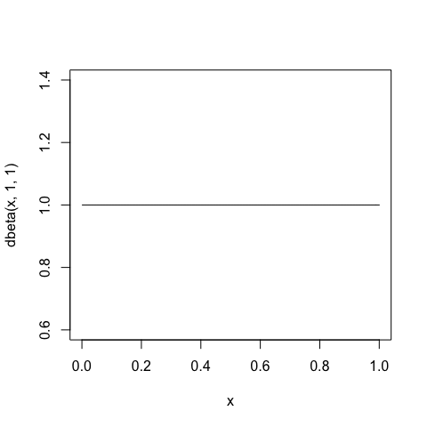
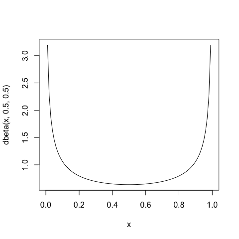
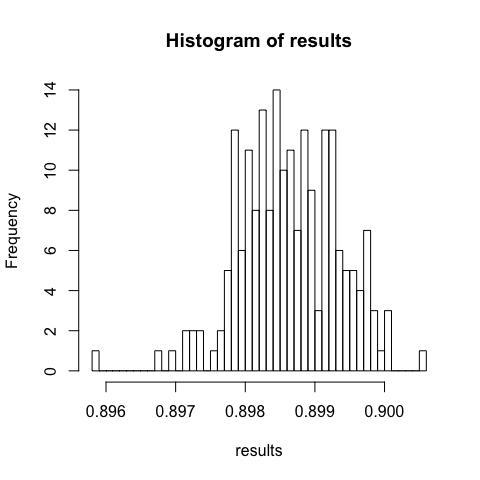

# Comparison of prior choices for binomial data
Florian Hartig  
Friday, June 19, 2015  


```r
knitr::opts_chunk$set(fig.width=5, fig.height=5)
```


```r
set.seed(123) # just for reproducability of the results. 

observation <- 0.99 # seed predation probability
N <- 100        # number of seeds per seed tray
replicates <- 200 

dat1 <- rbinom(n=replicates,size=N,prob=observation) 
```

## Bayesian analysis using flat prior 


```r
modelCode1 <- "
   model{
      # Likelihood
      y ~ dbin(pi,N)
      # Prior distributions
      pi ~ dbeta(1,1) # beta distribution
   }
"
```

Note that the beta-distribution with a=1 and b=1 equals the uniform distribution with min=0 and max=1.


```r
curve(dbeta(x,1,1))
```



OK, let's run the MCMC for the 50 data sets and storing the results


```r
library(R2jags)

results <- rep(NA,length(dat1))

for (i in 1:length(dat1)){
  Data = list(y = dat1[i], N=N)
  Inits = list(list("pi"=runif(1,0,1)),list("pi"=runif(1,0,1)),list("pi"=runif(1,0,1)))
  jags.fit <- jags(data=Data, 
                 inits=Inits, 
                 parameters.to.save=c("pi"), 
                 model.file=textConnection(modelCode1),
                 n.chains=3, 
                 n.iter=6000,
                 n.burnin=1000,
                 n.thin=5)
  results[i] <-  print(jags.fit)$summary[2,5] 
}
```

Summaries of the median parameter estimates of the 50 runs


```r
hist(results, breaks = 50)
```


```r
mean(results)
```

```
## [1] 0.9833818
```

We see the results are biased towards intermediate (0.5) values. 

## Analysis using Jeffrey's prior

Jeffrey's prior for this problem is 


```r
curve(dbeta(x,0.5,0.5))
```



Derivation of Jeffrey's prior for this problem available at http://www.cs.berkeley.edu/~jordan/courses/260-spring10/lectures/lecture7.pdf You can also watch the derivation on youtube https://www.youtube.com/watch?v=UyKqIYGAMHY (I haven't checked though if that source is accurate)

Run the model with that


```r
modelCode2 <- "
   model{
      # Likelihood
      y ~ dbin(pi,N)
      # Prior distributions
      pi ~ dbeta(1/2,1/2) # beta distribution
   }
"
```


```r
for (i in 1:length(dat1)){
  jags.fit <- jags(data=Data, 
                 inits=Inits, 
                 parameters.to.save=c("pi"), 
                 model.file=textConnection(modelCode2),
                 n.chains=3, 
                 n.iter=6000,
                 n.burnin=1000,
                 n.thin=5)
  results[i] <-  print(jags.fit)$summary[2,5] 
}
```

Bias is better, but still small bias towards 0.5.


```r
hist(results, breaks = 50)
```



```r
mean(results)
```

```
## [1] 0.9882096
```

## Maximum likelihood

The MLE for the binomial is simply given by the mean of success / trials. 


```r
mean(dat1/N)
```

```
## [1] 0.99
```

You see it's unbiased, which can be seen also mathematically.


---
**Copyright, reuse and updates**: copyright belongs to author(s) (see author statement at the top of the file). Reuse permitted under Creative Commons Attribution-NonCommercial-ShareAlike 4.0 International License

Sourcecode and potential future updates available at http://florianhartig.github.io/LearningBayes/ (follow the link under code, and then navigate through the topics to find the location of the file)
