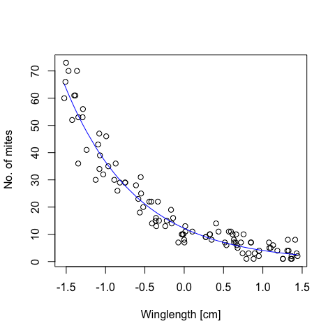
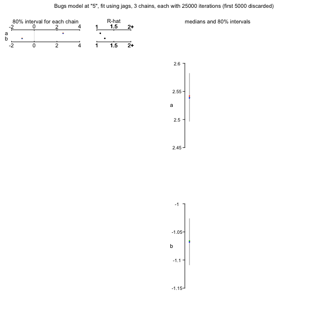
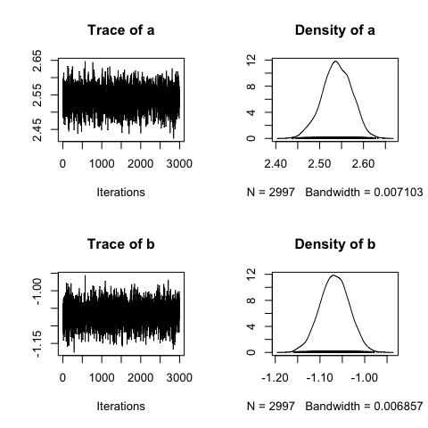
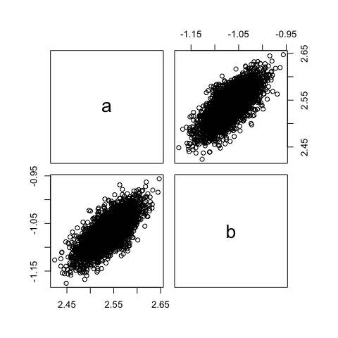
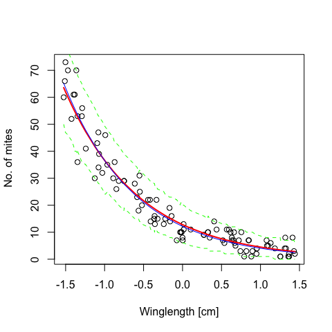

# Bayesian analysis of a Poisson GLM
Felix May  
Monday, June 22, 2015  


***

This example is a simplified version of chapter 15 in **Kery (2010) Introduction to WinBUGs for Ecologists, pages 193 -- 202.** 

We analyse the relationship between wing length and mite infection of dragon flies. Mite infection is quantified as the number of mites on each dragonfly. That means we have count data that we model with a Poisson error distribution.

### 1. Simulate data

This time we center the numeric exlanatory variable (Winglength) from the beginning. And in the Poisson model we use a log-link function and thus the exponential function as inverse of the link function.


```r
set.seed(12345)

n1 <- 100                                    # sample size
Winglength <- sort(runif(n1,5,8))            # explanatory variable
cWinglength <- Winglength - mean(Winglength) # center explanatory variable for easier model convergence

a.true <- 2.5    # intercept
b.true <- - 1.1  # slope

eta1 <- a.true+b.true*cWinglength     #linear predictor
lambda.true <- exp(eta1)              # inverse log-link function 

Mites <- rpois(n1,lambda=lambda.true) # add Poisson error

plot(Mites~cWinglength,xlab="Winglength [cm]",ylab=" No. of mites")
lines(lambda.true ~ cWinglength,col="blue")
```




###2. Bayesian analysis using JAGS

In the model specification we code the error distribution and the inverse link function in close correspondence to the data simulation. We use wide normal distributions as uninformative priors on the model parameters a and b.
Please note that there is no sigma as in the normal distribution, because in the Poisson distribution mean = variance by definition.


```r
modelCode <- "
   model{
      # Likelihood
      for(i in 1:n.max){
         y[i] ~ dpois(lambda[i])  # poisson error distribution
         lambda[i] <- exp(eta[i]) # inverse link function
         eta[i] <- a + b*x[i]     # linear predictor
      }
      # Prior distributions
      a ~ dnorm(0,0.001)
      b ~ dnorm(0,0.001)
   }"
```

Preparation for running JAGS


```r
Data <- list(y = Mites, x = cWinglength, n.max = length(Mites))
inits.fn <- function() list(a = rnorm(1,mean=0,sd=10), b = rnorm(1,mean=0,sd=10))
```

And call JAGS


```r
library(R2jags)
```

```
## Warning: package 'coda' was built under R version 3.1.3
```

```r
jags.fit <- jags(data=Data, 
                 inits=inits.fn,
                 parameters.to.save=c("a","b"), 
                 model.file=textConnection(modelCode),
                 n.chains=3, 
                 n.iter=25000,
                 n.burnin=5000,
                 n.thin=20,
                 DIC=F)
```

```
## Compiling model graph
##    Resolving undeclared variables
##    Allocating nodes
##    Graph Size: 505
## 
## Initializing model
```

The exploration of the JAGS output should be routine by now ...


```r
plot(jags.fit)
```



```r
print(jags.fit)
```

```
## Inference for Bugs model at "5", fit using jags,
##  3 chains, each with 25000 iterations (first 5000 discarded), n.thin = 20
##  n.sims = 3000 iterations saved
##   mu.vect sd.vect   2.5%    25%    50%    75%  97.5%  Rhat n.eff
## a   2.534   0.213  2.470  2.517  2.539  2.563  2.601 1.101  3000
## b  -1.070   0.112 -1.132 -1.089 -1.067 -1.046 -1.006 1.238  3000
## 
## For each parameter, n.eff is a crude measure of effective sample size,
## and Rhat is the potential scale reduction factor (at convergence, Rhat=1).
```

```r
jags.mcmc <- as.mcmc(jags.fit)

plot(jags.mcmc)     # check convergence and posterior distributions
```


```r
summary(jags.mcmc)
```

```
## 
## Iterations = 5001:24981
## Thinning interval = 20 
## Number of chains = 3 
## Sample size per chain = 1000 
## 
## 1. Empirical mean and standard deviation for each variable,
##    plus standard error of the mean:
## 
##     Mean     SD Naive SE Time-series SE
## a  2.534 0.2126 0.003881       0.003883
## b -1.070 0.1116 0.002037       0.002040
## 
## 2. Quantiles for each variable:
## 
##     2.5%    25%    50%    75%  97.5%
## a  2.470  2.517  2.539  2.563  2.601
## b -1.132 -1.089 -1.067 -1.046 -1.006
```

```r
gelman.diag(jags.mcmc)  # check convergence
```

```
## Potential scale reduction factors:
## 
##   Point est. Upper C.I.
## a          1          1
## b          1          1
## 
## Multivariate psrf
## 
## 1
```

```r
HPDinterval(jags.mcmc)  # posterior credible intervals
```

```
## [[1]]
##       lower     upper
## a  2.470496  2.597565
## b -1.124678 -1.004341
## attr(,"Probability")
## [1] 0.95
## 
## [[2]]
##       lower     upper
## a  2.467249  2.598981
## b -1.130498 -1.002738
## attr(,"Probability")
## [1] 0.95
## 
## [[3]]
##       lower     upper
## a  2.473795  2.602923
## b -1.133378 -1.010784
## attr(,"Probability")
## [1] 0.95
```

In the traceplots we see that there is a strange first value in the chains. This should not happen with an appropriate burn-in sample. We used 5000 burn-in samples, so this strange first value seems to be a bugs of JAGS. We simply remove the strange first value in the lumping of the 3 chains.


```r
head(jags.mcmc[[1]])
```

```
## Markov Chain Monte Carlo (MCMC) output:
## Start = 5001 
## End = 5121 
## Thinning interval = 20 
##              a         b
## [1,] -5.377681 -2.342335
## [2,]  2.537376 -1.074750
## [3,]  2.515566 -1.081477
## [4,]  2.595878 -1.055419
## [5,]  2.509818 -1.094031
## [6,]  2.571789 -1.072495
## [7,]  2.551523 -1.065912
```

```r
head(jags.mcmc[[2]])
```

```
## Markov Chain Monte Carlo (MCMC) output:
## Start = 5001 
## End = 5121 
## Thinning interval = 20 
##              a         b
## [1,] -5.796683 -6.774590
## [2,]  2.473973 -1.115904
## [3,]  2.514698 -1.074871
## [4,]  2.608894 -1.013425
## [5,]  2.533841 -1.103659
## [6,]  2.589688 -1.013555
## [7,]  2.481929 -1.136889
```

```r
head(jags.mcmc[[3]])
```

```
## Markov Chain Monte Carlo (MCMC) output:
## Start = 5001 
## End = 5121 
## Thinning interval = 20 
##             a         b
## [1,] 2.212756 -1.307373
## [2,] 2.506258 -1.066344
## [3,] 2.465154 -1.143125
## [4,] 2.545694 -1.034190
## [5,] 2.501993 -1.066741
## [6,] 2.438928 -1.111276
## [7,] 2.557900 -1.076618
```

```r
jags.mcmc.lumped <- as.mcmc(rbind(jags.mcmc[[1]][-1,],
                                  jags.mcmc[[2]][-1,],
                                  jags.mcmc[[3]][-1,]))
```

We again check the plots and assess the correlation among the parameters.


```r
plot(jags.mcmc.lumped)
```



```r
pairs(as.data.frame(jags.mcmc.lumped))
```



```r
cor(as.data.frame(jags.mcmc.lumped))
```

```
##           a         b
## a 1.0000000 0.7265228
## b 0.7265228 1.0000000
```

We find that despite the centering of Winglength there is correlation between the samples of a and b. This is not a problem or mistake in our analysis, but this is a common finding for more complex, non-linear models.


###3. Predictions and uncertainty

As a last step we want to plot the data, the predictions and their uncertainty. We again use a loop over all MCMC samples. This time we only calculate the predictive uncertainty for a single measurements, that means we include the random error component of the Poisson distribution.


```r
pred1 <- matrix(NA,nrow=nrow(jags.mcmc.lumped),ncol=length(Mites))
for (i in 1:nrow(pred1)){
   lambda.pred <- exp(jags.mcmc.lumped[i,"a"] + cWinglength*jags.mcmc.lumped[i,"b"])
   pred1[i,] <- rpois(length(cWinglength),lambda=lambda.pred) # Poisson error                 
}
```

From this matrix we then calculate the 95% credible intervals.


```r
lower2 <- apply(pred1,MARGIN=2,quantile,prob=0.025)
upper2 <- apply(pred1,MARGIN=2,quantile,prob=0.975)
```

And finally the posterior mean prediction.


```r
posterior.mean.pred <- exp(mean(jags.mcmc.lumped[i,"a"]) + cWinglength*mean(jags.mcmc.lumped[i,"b"]))
```

Here is the plot we would like to have in the end. We also add the "true" line to see that the Bayesian estimation is pretty close to the simulated model.


```r
plot(Mites~cWinglength,xlab="Winglength [cm]",ylab=" No. of mites")

lines(cWinglength,posterior.mean.pred,col="red",lwd=2)

lines(cWinglength,lower2,col="green",lwd=1,lty=2)
lines(cWinglength,upper2,col="green",lwd=1,lty=2)

lines(cWinglength,lambda.true,col="blue") # "true" model
```




**Copyright, reuse and updates**: copyright belongs to author(s) (see author statement at the top of the file). Reuse permitted under Creative Commons Attribution-NonCommercial-ShareAlike 4.0 International License

Sourcecode and potential future updates available at http://florianhartig.github.io/LearningBayes/ (follow the link under code, and then navigate through the topics to find the location of the file)
