# Beetles
Florian Hartig  
7 Jun 2015  


```
## Loading required package: rjags
```

```
## Loading required package: coda
```

```
## Warning: package 'coda' was built under R version 3.1.3
```

```
## Linked to JAGS 3.4.0
```

```
## Loaded modules: basemod,bugs
```

```
## 
## Attaching package: 'R2jags'
```

```
## The following object is masked from 'package:coda':
## 
##     traceplot
```

```
## Warning: package 'runjags' was built under R version 3.1.3
```


## Dataset


Measured beetle counts over 20 years on 50 different plots across an altitudinal gradient

<font size="4">

</font>


What is the altitudinal niche of the species?

### Preparation


```r
library(R2jags)
modelData=as.list(data)
modelData = append(data, list(nobs=1000, nplots = 50, nyears = 20))

head(data)
```

```
##   dataID beetles altitude plot year spatialCoordinate
## 1      1       1        0    1    1                 0
## 2      2       1        0    1    2                 0
## 3      3       8        0    1    3                 0
## 4      4       0        0    1    4                 0
## 5      5       0        0    1    5                 0
## 6      6       0        0    1    6                 0
```

## Basic model


```r
modelstring="
  model {

    # Likelihood
    for (i in 1:nobs) {
      beetles[i]~dpois(lambda[i]) 

      lambda[i] <- exp(intercept + alt * altitude[i] + alt2 * altitude[i] * altitude[i] ) 
    }

    # Effect priors 
    intercept ~ dnorm(0,0.0001)
    alt ~ dnorm(0,0.0001)
    alt2 ~ dnorm(0,0.0001)

    # Predictions
    for (i in 1:nobs) {
      beetlesPred[i]~dpois(lambda[i])
    }
    Prediction <- sum(beetlesPred)


  }
"

#Running this

model=jags(model.file = textConnection(modelstring), data=modelData, n.iter=10000,  parameters.to.save = c("intercept", "alt", "alt2", "Prediction", "Ryear", "zeroMu", "sigmaYear"), DIC = F)
```

```
## module glm loaded
## module dic loaded
```

```
## Compiling model graph
##    Resolving undeclared variables
##    Allocating nodes
##    Graph Size: 3208
## 
## Initializing model
```

```r
plot(model, display.parallel = T)
```

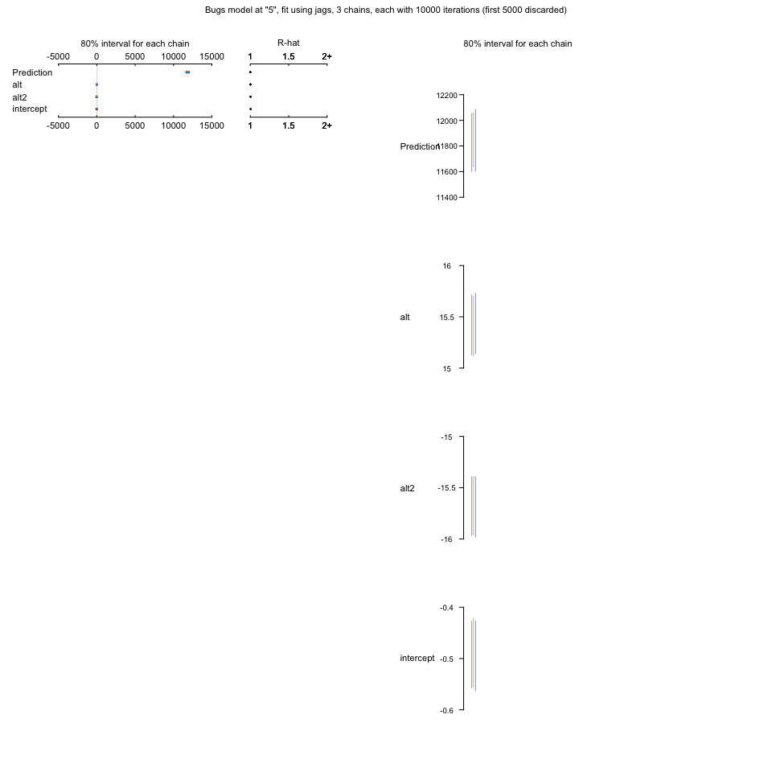

```r
altitude <- seq(0,1,len = 50)
```

Plot the results


```r
plot(data$altitude + runif(1000,-0.02,0.02), log(data$beetles + 1 ))


combinedChainValues <- as.data.frame(combine.mcmc(as.mcmc(model)))

for(i in seq(5,nrow(combinedChainValues), 5)){
  response <- exp(combinedChainValues$intercept[i] + combinedChainValues$alt[i] * altitude + combinedChainValues$alt2[i] * altitude^2)
  lines(altitude, log(response + 1), col = "#22222202", lwd = 3)
}

lines(altitude, log(exp(12*altitude - 12*altitude^2) + 1), col = "red" )
```

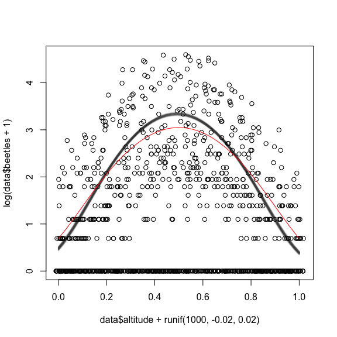

```r
# Bayesian p-value
hist(combinedChainValues$Prediction, breaks = 100, xlim = c(0, 30000))
abline(v=sum(data$beetles), col = "red")
```

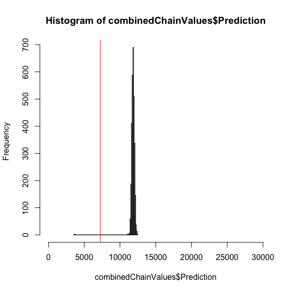

```r
# numerical value
ecdf(combinedChainValues$Prediction)(sum(data$beetles))
```

```
## [1] 0.001
```


## Adding a random effect for year


```r
modelstring="
  model {

    # Likelihood
    for (i in 1:nobs) {
      beetles[i]~dpois(lambda[i]) 

      lambda[i] <- exp(intercept + (alt + Ryear[year[i]]) * altitude[i] + alt2 * altitude[i] * altitude[i]   )
    }

    # Effect priors 
    intercept ~ dnorm(0,0.0001)
    alt ~ dnorm(0,0.0001)
    alt2 ~ dnorm(0,0.0001)

    # Random effects 

    for (i in 1:nyears) {
      Ryear[i]~dnorm(0,sigmaYear)
    }

    # Variance priors 
    sigmaYear~dgamma(1,2)

    # Predictions
    for (i in 1:nobs) {
      beetlesPred[i]~dpois(lambda[i])
    }
    Prediction <- sum(beetlesPred)


  }
"

#Running this

model=jags(model.file = textConnection(modelstring), data=modelData, n.iter=10000,  parameters.to.save = c("intercept", "alt", "alt2", "Prediction", "Ryear", "zeroMu", "sigmaYear"), DIC = F)
```

```
## module glm loaded
## module dic loaded
```

```
## Compiling model graph
##    Resolving undeclared variables
##    Allocating nodes
##    Graph Size: 7102
## 
## Initializing model
```

```r
plot(model, display.parallel = T)
```

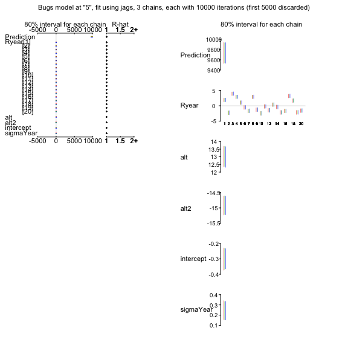

```r
altitude <- seq(0,1,len = 50)
```

Plot the results


```r
plot(data$altitude + runif(1000,-0.02,0.02), log(data$beetles + 1 ))


combinedChainValues <- as.data.frame(combine.mcmc(as.mcmc(model)))

for(i in seq(5,nrow(combinedChainValues), 5)){
  response <- exp(combinedChainValues$intercept[i] + combinedChainValues$alt[i] * altitude + combinedChainValues$alt2[i] * altitude^2)
  lines(altitude, log(response + 1), col = "#22222202", lwd = 3)
}

lines(altitude, log(exp(12*altitude - 12*altitude^2) + 1), col = "red" )
```

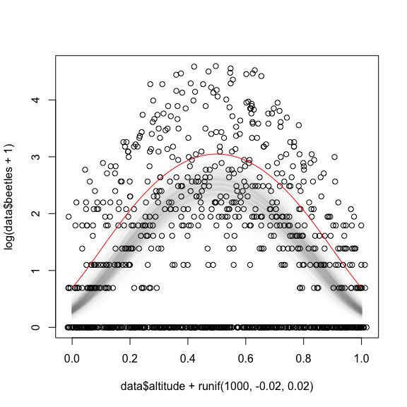

```r
# Bayesian p-value
hist(combinedChainValues$Prediction, breaks = 100, xlim = c(0, 20000))
abline(v=sum(data$beetles), col = "red")
```

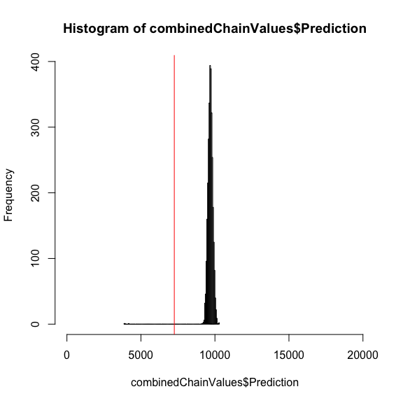

```r
# numerical value
ecdf(combinedChainValues$Prediction)(sum(data$beetles))
```

```
## [1] 0.001
```

## Adding Overdispersion via random effect on each data point


```r
modelstring="
  model {

    # Likelihood
    for (i in 1:nobs) {
      beetles[i]~dpois(lambda[i]) 

      lambda[i] <- (exp(intercept + alt * altitude[i] + alt2 * altitude[i] * altitude[i] + Ryear[year[i]] + RID[i] ))
    }

    # Effect priors 
    intercept ~ dnorm(0,0.0001)
    alt ~ dnorm(0,0.0001)
    alt2 ~ dnorm(0,0.0001)

    # Random effects 

    for (i in 1:nyears) {
      Ryear[i]~dnorm(0,sigmaYear)
    }

    for (i in 1:nobs) {
      RID[i]~dnorm(0,sigmaID)
    }

    # Variance priors 
    sigmaYear~dgamma(1,2)
    sigmaID~dgamma(0.001,0.001)

    # Predictions
    for (i in 1:nobs) {
      beetlesPred[i]~dpois(lambda[i])
    }
    Prediction <- sum(beetlesPred)


  }
"

#Running this

model=jags(model.file = textConnection(modelstring), data=modelData, n.iter=30000,  parameters.to.save = c("intercept", "alt", "alt2", "Prediction", "Ryear", "zeroMu", "sigmaYear"), DIC = F)
```

```
## Compiling model graph
##    Resolving undeclared variables
##    Allocating nodes
##    Graph Size: 7134
## 
## Initializing model
```

```r
plot(model, display.parallel = T)
```

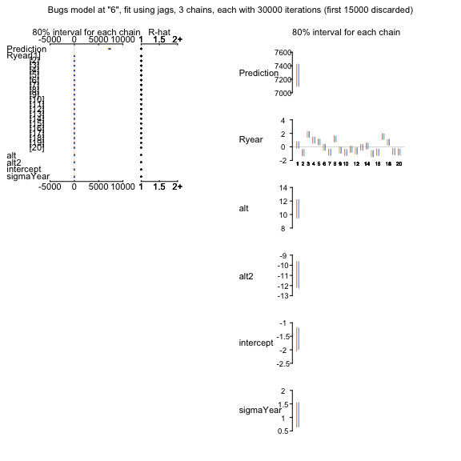

```r
altitude <- seq(0,1,len = 50)
```

Plot the results


```r
plot(data$altitude + runif(1000,-0.02,0.02), log(data$beetles + 1 ))


combinedChainValues <- as.data.frame(combine.mcmc(as.mcmc(model)))

for(i in seq(5,nrow(combinedChainValues), 5)){
  response <- exp(combinedChainValues$intercept[i] + combinedChainValues$alt[i] * altitude + combinedChainValues$alt2[i] * altitude^2)
  lines(altitude, log(response + 1), col = "#22222202", lwd = 3)
}

lines(altitude, log(exp(12*altitude - 12*altitude^2) + 1), col = "red" )
```

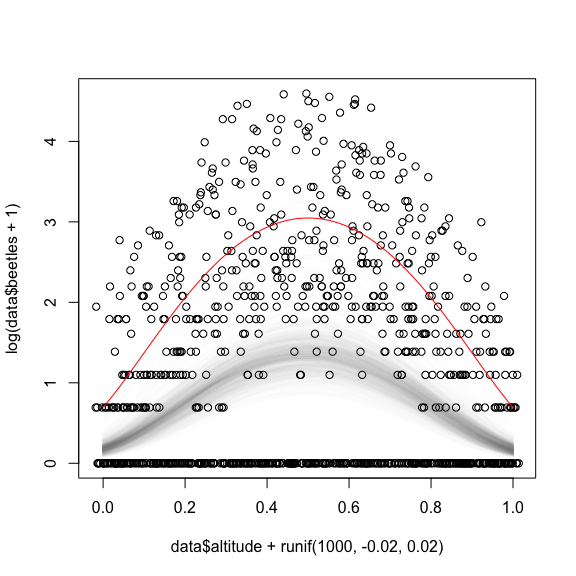

```r
# Bayesian p-value
hist(combinedChainValues$Prediction, breaks = 100, xlim = c(0, 20000))
abline(v=sum(data$beetles), col = "red")
```

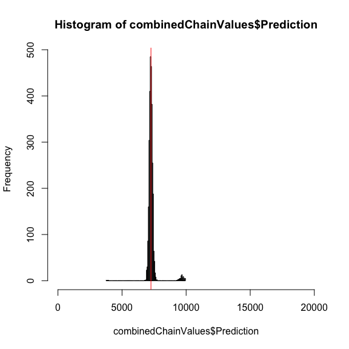

```r
# numerical value
ecdf(combinedChainValues$Prediction)(sum(data$beetles))
```

```
## [1] 0.5173333
```


## Adding Zero-Inflation


```r
modelstring="
  model {

    # Likelihood
    for (i in 1:nobs) {
      beetles[i]~dpois(lambda[i]) 

      lambda[i] <- (exp(intercept + alt * altitude[i] + alt2 * altitude[i] * altitude[i] + Ryear[year[i]] + RID[i] ))* Zero[i] + 0.00000001
    }
    # to add another random effect + Rplot[plot[i]] 
    # to add overdispersion + RID[i]

    # Effect priors 
    intercept ~ dnorm(0,0.0001)
    alt ~ dnorm(0,0.0001)
    alt2 ~ dnorm(0,0.0001)

    # Random effects 

    for (i in 1:nyears) {
      Ryear[i]~dnorm(0,sigmaYear)
    }

    for (i in 1:nobs) {
      RID[i]~dnorm(0,sigmaID)
    }

    # Variance priors 
    sigmaYear~dgamma(1,2)
    sigmaID~dgamma(0.001,0.001)

    # Zeroinflation

    for (i in 1:nobs) {
      Zero[i]~dbern(zeroMu)
    }
    zeroMu ~ dunif(0,1)

    # Predictions
    for (i in 1:nobs) {
      beetlesPred[i]~dpois(lambda[i])
    }
    Prediction <- sum(beetlesPred)


  }
"

#Running this

model=jags(model.file = textConnection(modelstring), data=modelData, n.iter=30000,  parameters.to.save = c("intercept", "alt", "alt2", "Prediction", "Ryear", "zeroMu", "sigmaYear"), DIC = F)
```

```
## Compiling model graph
##    Resolving undeclared variables
##    Allocating nodes
##    Graph Size: 10136
## 
## Initializing model
```

```r
plot(model, display.parallel = T)
```

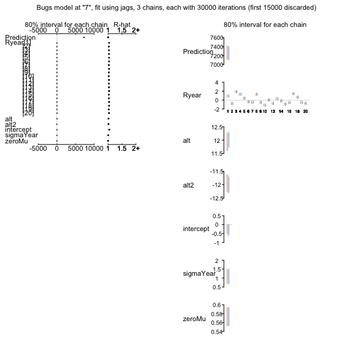

```r
altitude <- seq(0,1,len = 50)
```

Plot the results


```r
plot(data$altitude + runif(1000,-0.02,0.02), log(data$beetles + 1 ))


combinedChainValues <- as.data.frame(combine.mcmc(as.mcmc(model)))

for(i in seq(5,nrow(combinedChainValues), 5)){
  response <- exp(combinedChainValues$intercept[i] + combinedChainValues$alt[i] * altitude + combinedChainValues$alt2[i] * altitude^2)
  lines(altitude, log(response + 1), col = "#22222202", lwd = 3)
}

lines(altitude, log(exp(12*altitude - 12*altitude^2) + 1), col = "red" )
```

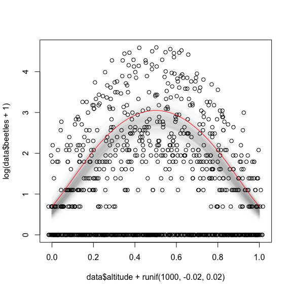

```r
# Bayesian p-value
hist(combinedChainValues$Prediction, breaks = 100, xlim = c(0, 20000))
abline(v=sum(data$beetles), col = "red")
```

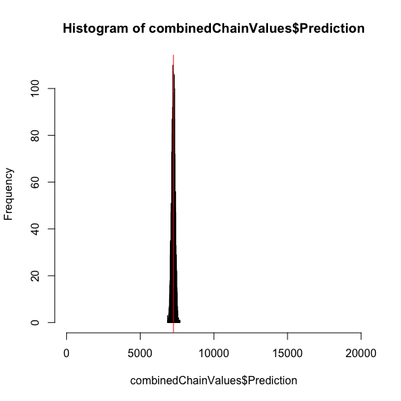

```r
# numerical value
ecdf(combinedChainValues$Prediction)(sum(data$beetles))
```

```
## [1] 0.5056667
```

---
**Copyright, reuse and updates**: By Florian Hartig. Updates will be posted at https://github.com/florianhartig/LearningBayes. Reuse permitted under Creative Commons Attribution-NonCommercial-ShareAlike 4.0 International License

