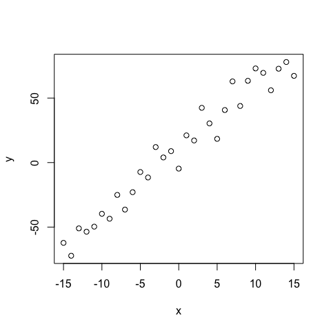
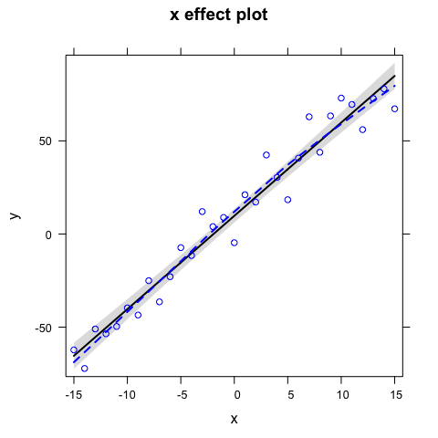
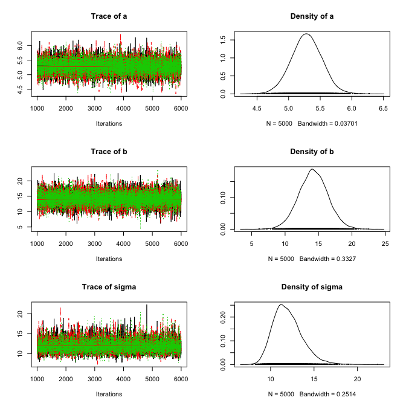
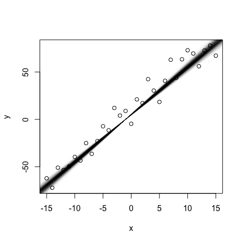
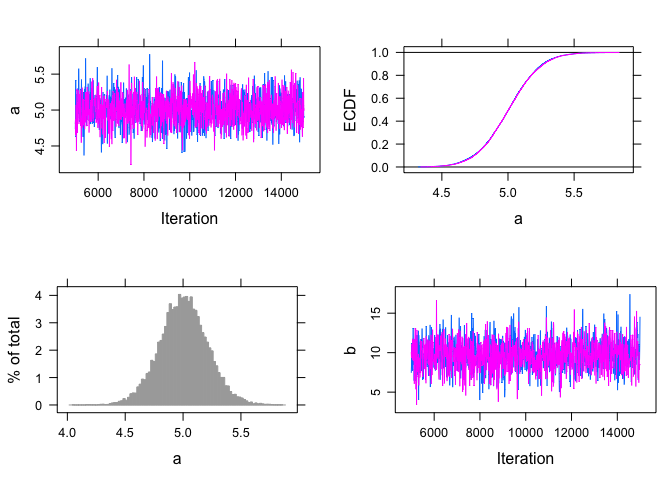
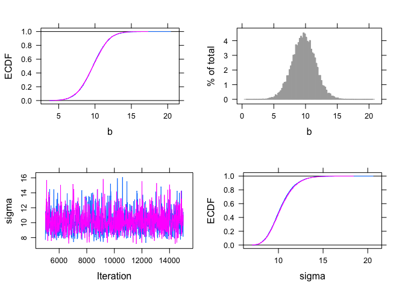
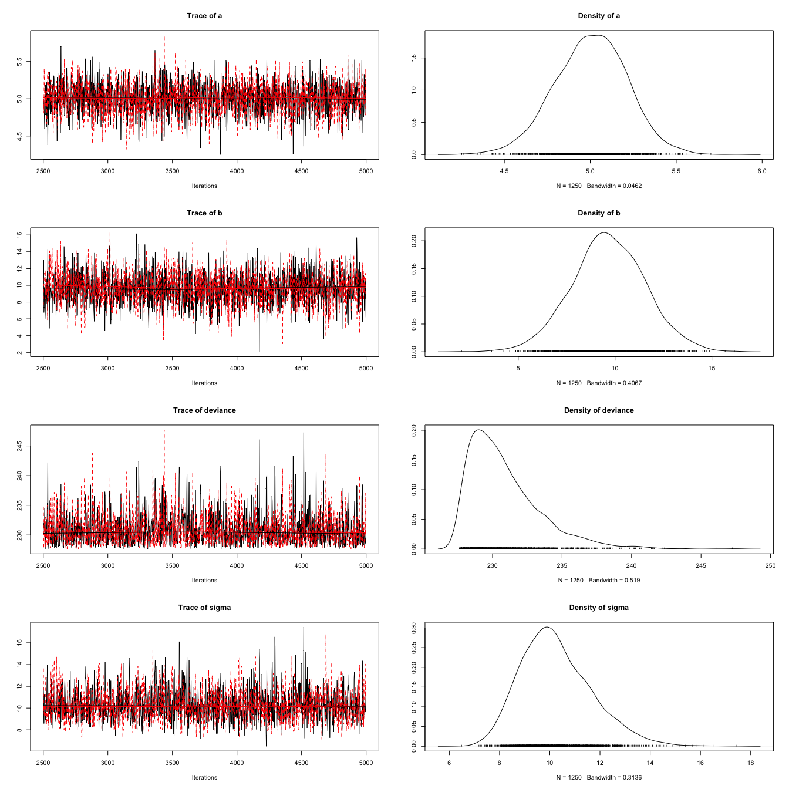

# Linear regression with Jags
Florian Hartig  
30 Jul 2014  


## Creation of test data


```r
a <- 5
b <- 10
sigma <- 10

x <- -15:15
y <- a * x + b + rnorm(31,0,sd = sigma)
plot(x,y)
```

 

## Non-Bayesian analysis of this model


```r
fit <- lm(y ~ x)
summary(fit)
```

```
## 
## Call:
## lm(formula = y ~ x)
## 
## Residuals:
##     Min      1Q  Median      3Q     Max 
## -17.532  -8.802   1.235   6.572  29.200 
## 
## Coefficients:
##             Estimate Std. Error t value Pr(>|t|)    
## (Intercept)  14.2347     2.0600    6.91 1.36e-07 ***
## x             5.2881     0.2303   22.96  < 2e-16 ***
## ---
## Signif. codes:  0 '***' 0.001 '**' 0.01 '*' 0.05 '.' 0.1 ' ' 1
## 
## Residual standard error: 11.47 on 29 degrees of freedom
## Multiple R-squared:  0.9479,	Adjusted R-squared:  0.9461 
## F-statistic: 527.2 on 1 and 29 DF,  p-value: < 2.2e-16
```

```r
plot(allEffects(fit, partial.residuals = T))
```

 


## Bayesian analysis of this model (in Jags)


```r
  # 1) Model definition exactly how we created our data 
  modelCode = "
    model{
      # Likelihood
      for(i in 1:i.max){
      y[i] ~ dnorm(mu[i],tau)
      mu[i] <- a*x[i] + b
      }
      # Prior distributions
      a ~ dnorm(0,0.001)
      b ~ dnorm(0,0.001)
      tau <- 1/(sigma*sigma)
      sigma ~ dunif(0,100)
    }
  "
  
  # 2) Set up a list that contains all the necessary data (here, including parameters of the prior distribution)
  Data = list(y = y, x = x, i.max = length(y))

  # 3) Specify a function to generate inital values for the parameters
  inits.fn <- function() list(a = rnorm(1), b = rnorm(1), sigma = runif(1,1,100))
```


Running the model with rjags


```r
  # Compile the model and run the MCMC for an adaptation (burn-in) phase
  jagsModel <- jags.model(file= textConnection(modelCode), data=Data, init = inits.fn, n.chains = 3, n.adapt= 1000)
```

```
## Compiling model graph
##    Resolving undeclared variables
##    Allocating nodes
##    Graph Size: 134
## 
## Initializing model
```

```r
  # Specify parameters for which posterior samples are saved
  para.names <- c("a","b","sigma")

  # Continue the MCMC runs with sampling
  Samples <- coda.samples(jagsModel, variable.names = para.names, n.iter = 5000)
  
  # Plot the mcmc chain and the posterior sample for p
  plot(Samples)
```

 

convergence check


```r
gelman.diag(Samples)
```

```
## Potential scale reduction factors:
## 
##       Point est. Upper C.I.
## a              1          1
## b              1          1
## sigma          1          1
## 
## Multivariate psrf
## 
## 1
```


```r
summary(Samples)
```

```
## 
## Iterations = 1001:6000
## Thinning interval = 1 
## Number of chains = 3 
## Sample size per chain = 5000 
## 
## 1. Empirical mean and standard deviation for each variable,
##    plus standard error of the mean:
## 
##         Mean     SD Naive SE Time-series SE
## a      5.285 0.2418 0.001974        0.00196
## b     14.224 2.1678 0.017700        0.01703
## sigma 11.979 1.6791 0.013710        0.02030
## 
## 2. Quantiles for each variable:
## 
##        2.5%    25%    50%    75%  97.5%
## a     4.804  5.126  5.284  5.446  5.758
## b     9.954 12.780 14.218 15.657 18.531
## sigma 9.233 10.789 11.794 12.964 15.786
```

predictions (not very elegant)


```r
plot(x,y)
sampleMatrix <- as.matrix(Samples)
selection <- sample(dim(sampleMatrix)[1], 1000)
for (i in selection) abline(sampleMatrix[i,1], sampleMatrix[i,1], col = "#11111105")
```

 

# Running the model with runjags


```r
runJagsResults <- run.jags(model=modelCode, monitor=c("a","b","sigma"), data=Data, n.chains=2, method="rjags", inits=inits.fn)
```

```
## Compiling rjags model...
## Calling the simulation using the rjags method...
## Adapting the model for 1000 iterations...
## Burning in the model for 4000 iterations...
## Running the model for 10000 iterations...
## Simulation complete
## Calculating summary statistics...
## Calculating the Gelman-Rubin statistic for 3 variables....
## Finished running the simulation
```

```r
plot(runJagsResults)
```

```
## Generating plots...
```

   


# Running the model with R2jags


```r
R2JagsResults <- jags(data=Data, inits=inits.fn, parameters.to.save=c("a","b","sigma"), n.chains=2, n.iter=5000, model.file=textConnection(modelCode))
```

```
## module glm loaded
```

```
## Compiling model graph
##    Resolving undeclared variables
##    Allocating nodes
##    Graph Size: 134
## 
## Initializing model
```

```r
plot(R2JagsResults)
```

 

```r
print(R2JagsResults)
```

```
## Inference for Bugs model at "6", fit using jags,
##  2 chains, each with 5000 iterations (first 2500 discarded), n.thin = 2
##  n.sims = 2500 iterations saved
##          mu.vect sd.vect    2.5%     25%     50%     75%   97.5%  Rhat
## a          5.297   0.239   4.844   5.130   5.290   5.456   5.763 1.001
## b         14.116   2.209   9.764  12.759  14.154  15.545  18.400 1.001
## sigma     11.967   1.670   9.202  10.770  11.808  12.952  15.869 1.001
## deviance 240.446   2.648 237.417 238.511 239.765 241.712 247.115 1.001
##          n.eff
## a         2500
## b         2500
## sigma     2500
## deviance  2500
## 
## For each parameter, n.eff is a crude measure of effective sample size,
## and Rhat is the potential scale reduction factor (at convergence, Rhat=1).
## 
## DIC info (using the rule, pD = var(deviance)/2)
## pD = 3.5 and DIC = 244.0
## DIC is an estimate of expected predictive error (lower deviance is better).
```

Change to coda standard format


```r
R2JagsCoda <- as.mcmc(R2JagsResults)
plot(R2JagsCoda)
```

 

```r
summary(R2JagsCoda)
```

```
## 
## Iterations = 2501:4999
## Thinning interval = 2 
## Number of chains = 2 
## Sample size per chain = 1250 
## 
## 1. Empirical mean and standard deviation for each variable,
##    plus standard error of the mean:
## 
##             Mean     SD Naive SE Time-series SE
## a          5.297 0.2392 0.004784       0.005226
## b         14.116 2.2093 0.044187       0.041998
## deviance 240.446 2.6478 0.052956       0.061182
## sigma     11.967 1.6704 0.033409       0.037996
## 
## 2. Quantiles for each variable:
## 
##             2.5%    25%    50%     75%   97.5%
## a          4.844   5.13   5.29   5.456   5.763
## b          9.764  12.76  14.15  15.545  18.400
## deviance 237.417 238.51 239.77 241.712 247.115
## sigma      9.202  10.77  11.81  12.952  15.869
```


---
**Copyright, reuse and updates**: By Florian Hartig. Updates will be posted at https://github.com/florianhartig/LearningBayes. Reuse permitted under Creative Commons Attribution-NonCommercial-ShareAlike 4.0 International License
