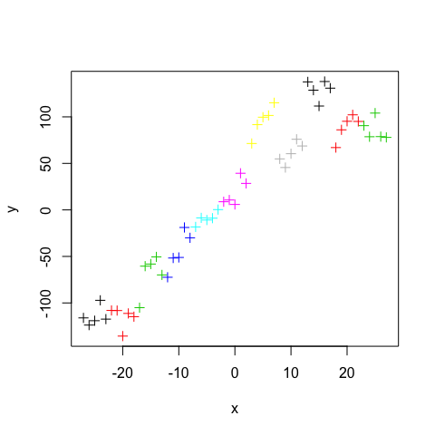
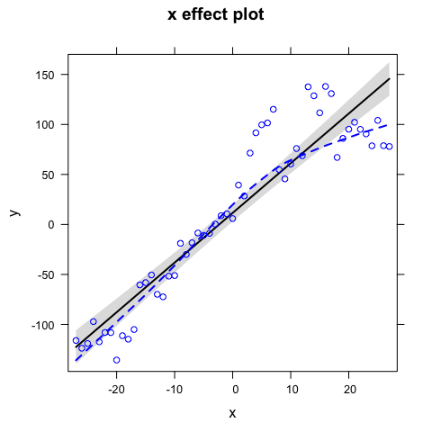
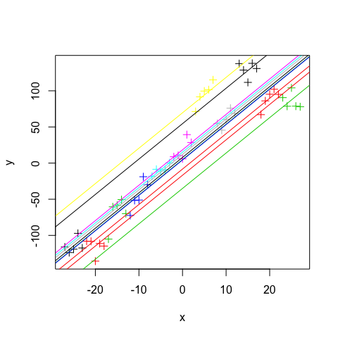
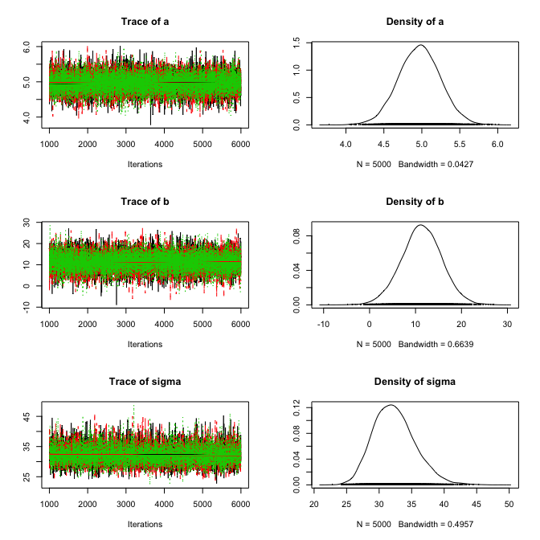
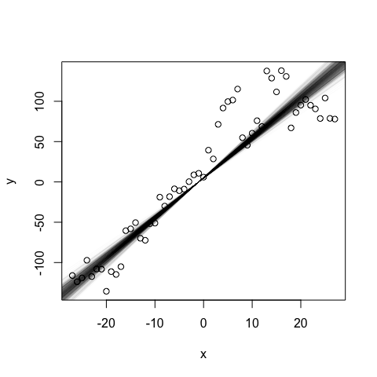
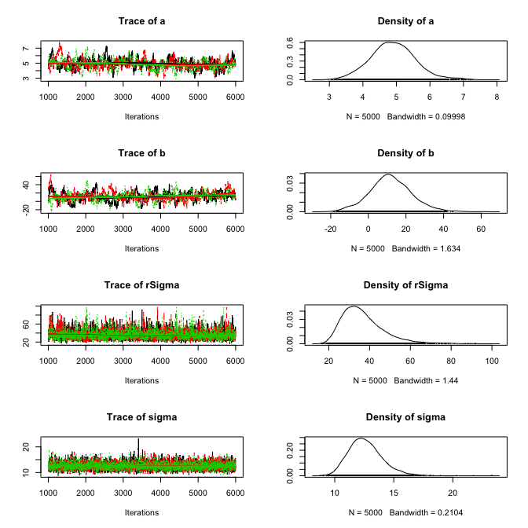
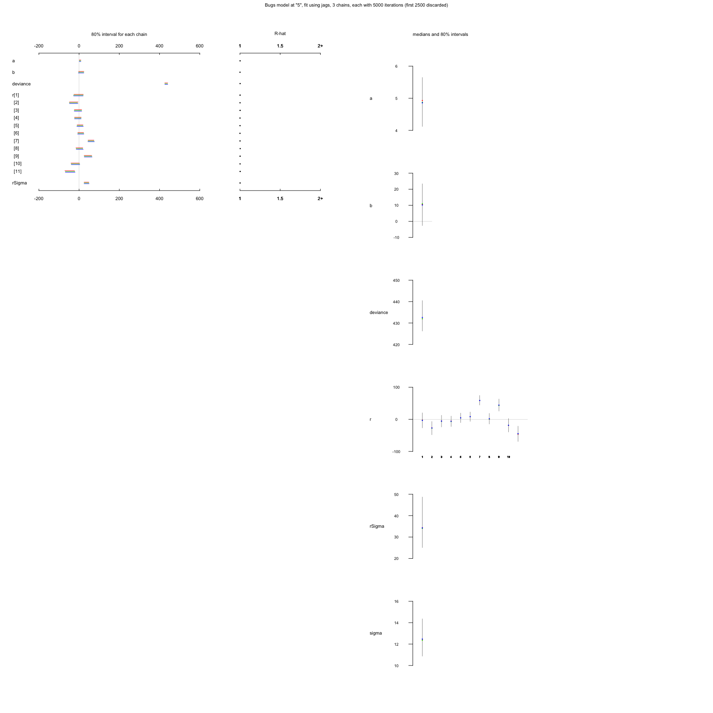

# A simple linear mixed model with Jags
Florian Hartig  
30 Jul 2014  


## Creation of test data

I create a test dataset with a linear dependency between x and y, with an additional effect that is applied on a grouping factor - you can think of this as a region or site. The structure conforms to a random intercept model.


```r
a <- 5
b <- 10
sigma <- 10
rsigma = 30
group = rep(1:11, each = 5)
randomEffect = rnorm(11, sd = rsigma)

x <- -27:27
y <- a * x + b + rnorm(55,0,sd = sigma) + randomEffect[group]
plot(x,y, col = group, pch = 3)
```



# Frequentist analysis of this data

## Non-Bayesian analysis of this model, linear model


```r
fit <- lm(y ~ x)
summary(fit)
```

```
## 
## Call:
## lm(formula = y ~ x)
## 
## Residuals:
##     Min      1Q  Median      3Q     Max 
## -67.728 -16.231  -0.816   9.725  68.858 
## 
## Coefficients:
##             Estimate Std. Error t value Pr(>|t|)    
## (Intercept)  11.5326     4.2613   2.706  0.00913 ** 
## x             4.9676     0.2684  18.506  < 2e-16 ***
## ---
## Signif. codes:  0 '***' 0.001 '**' 0.01 '*' 0.05 '.' 0.1 ' ' 1
## 
## Residual standard error: 31.6 on 53 degrees of freedom
## Multiple R-squared:  0.866,	Adjusted R-squared:  0.8634 
## F-statistic: 342.5 on 1 and 53 DF,  p-value: < 2.2e-16
```

```r
plot(allEffects(fit, partial.residuals = T))
```



## Non-Bayesian analysis of this model, linear mixed model

Adding the random intercept on group. Note that the variances are not correctly estimated. 


```r
fit <- lmer(y ~ x + (1|group))
summary(fit)
```

```
## Linear mixed model fit by REML ['lmerMod']
## Formula: y ~ x + (1 | group)
## 
## REML criterion at convergence: 461.1
## 
## Scaled residuals: 
##      Min       1Q   Median       3Q      Max 
## -2.18558 -0.55305  0.01204  0.65120  1.70609 
## 
## Random effects:
##  Groups   Name        Variance Std.Dev.
##  group    (Intercept) 979.2    31.29   
##  Residual             148.9    12.20   
## Number of obs: 55, groups:  group, 11
## 
## Fixed effects:
##             Estimate Std. Error t value
## (Intercept)  11.5326     9.5775   1.204
## x             4.8974     0.5373   9.115
## 
## Correlation of Fixed Effects:
##   (Intr)
## x 0.000
```

```r
plot(x,y, col = group,  pch = 3)
for(i in 1:11){
  abline(coef(fit)$group[i,1], coef(fit)$group[i,2], col = i)
}
```



# Bayesian analysis of this data

## Linear model (in Jags)


```r
  # 1) Model definition exactly how we created our data 
  modelCode = "
    model{
      
      # Likelihood
      for(i in 1:i.max){
        y[i] ~ dnorm(mu[i],tau)
        mu[i] <- a*x[i] + b
      }

      # Prior distributions
      a ~ dnorm(0,0.001)
      b ~ dnorm(0,0.001)
      tau <- 1/(sigma*sigma)
      sigma ~ dunif(0,100)
    }
  "
  
  # 2) Set up a list that contains all the necessary data (here, including parameters of the prior distribution)
  Data = list(y = y, x = x, i.max = length(y))

  # 3) Specify a function to generate inital values for the parameters
  inits.fn <- function() list(a = rnorm(1), b = rnorm(1), sigma = runif(1,1,100))
```

We have different options to run this model - I first show the most simple package, rjags:

Running the model with rjags


```r
  # Compile the model and run the MCMC for an adaptation (burn-in) phase
  jagsModel <- jags.model(file= textConnection(modelCode), data=Data, init = inits.fn, n.chains = 3, n.adapt= 1000)
```

```
## Compiling model graph
##    Resolving undeclared variables
##    Allocating nodes
##    Graph Size: 230
## 
## Initializing model
```

```r
  # Specify parameters for which posterior samples are saved
  para.names <- c("a","b","sigma")

  # Continue the MCMC runs with sampling
  Samples <- coda.samples(jagsModel, variable.names = para.names, n.iter = 5000)
  
  # Plot the mcmc chain and the posterior sample for p
  plot(Samples)
```



convergence check


```r
gelman.diag(Samples)
```

```
## Potential scale reduction factors:
## 
##       Point est. Upper C.I.
## a              1          1
## b              1          1
## sigma          1          1
## 
## Multivariate psrf
## 
## 1
```


```r
summary(Samples)
```

```
## 
## Iterations = 1001:6000
## Thinning interval = 1 
## Number of chains = 3 
## Sample size per chain = 5000 
## 
## 1. Empirical mean and standard deviation for each variable,
##    plus standard error of the mean:
## 
##         Mean     SD Naive SE Time-series SE
## a      4.969 0.2756  0.00225       0.002251
## b     11.320 4.3739  0.03571       0.034626
## sigma 32.343 3.2181  0.02628       0.035255
## 
## 2. Quantiles for each variable:
## 
##         2.5%    25%   50%    75%  97.5%
## a      4.432  4.784  4.97  5.154  5.513
## b      2.642  8.475 11.34 14.217 19.887
## sigma 26.804 30.040 32.10 34.328 39.310
```

predictions (not very elegant)


```r
plot(x,y)
sampleMatrix <- as.matrix(Samples)
selection <- sample(dim(sampleMatrix)[1], 1000)
for (i in selection) abline(sampleMatrix[i,1], sampleMatrix[i,1], col = "#11111105")
```




## Adding a random effect


```r
  # 1) Model definition exactly how we created our data 
  modelCode = "
    model{
      
      # Likelihood
      for(i in 1:i.max){
        y[i] ~ dnorm(mu[i],tau)
        mu[i] <- a*x[i] + b + r[group[i]]
      }

      # random effect
      for(i in 1:nGroups){
        r[i] ~ dnorm(0,rTau)
      }

      # Prior distributions
      a ~ dnorm(0,0.001)
      b ~ dnorm(0,0.001)

      tau <- 1/(sigma*sigma)
      sigma ~ dunif(0,100)

      rTau <- 1/(rSigma*rSigma)
      rSigma ~ dunif(0,100)
    }
  "
  
  # 2) Set up a list that contains all the necessary data (here, including parameters of the prior distribution)
  Data = list(y = y, x = x, i.max = length(y), group = group, nGroups = 11)

  # 3) Specify a function to generate inital values for the parameters
  inits.fn <- function() list(a = rnorm(1), b = rnorm(1), sigma = runif(1,1,100), rSigma = runif(1,1,100))
```


Running the model with rjags


```r
  # Compile the model and run the MCMC for an adaptation (burn-in) phase
  jagsModel <- jags.model(file= textConnection(modelCode), data=Data, init = inits.fn, n.chains = 3, n.adapt= 1000)
```

```
## Compiling model graph
##    Resolving undeclared variables
##    Allocating nodes
##    Graph Size: 300
## 
## Initializing model
```

```r
  # Specify parameters for which posterior samples are saved
  para.names <- c("a","b","sigma", "rSigma")

  # Continue the MCMC runs with sampling
  Samples <- coda.samples(jagsModel, variable.names = para.names, n.iter = 5000)
  
  # Plot the mcmc chain and the posterior sample for p
  plot(Samples)
```




# Running the model with R2jags

For random effects and similar, I often prefer the R2jags package - not only that it has a bit simpler interface, but it also has different standard plots (those are taken from the STAN / Rstan package), which are a bit more complicated at first, but make it easier to display random effects. 


```r
R2JagsResults <- jags(data=Data, inits=inits.fn, parameters.to.save=c("a","b","sigma", "rSigma", "r"), n.chains=3, n.iter=5000, model.file=textConnection(modelCode))
```

```
## module glm loaded
```

```
## Compiling model graph
##    Resolving undeclared variables
##    Allocating nodes
##    Graph Size: 300
## 
## Initializing model
```

```r
plot(R2JagsResults)
```



```r
print(R2JagsResults)
```

```
## Inference for Bugs model at "5", fit using jags,
##  3 chains, each with 5000 iterations (first 2500 discarded), n.thin = 2
##  n.sims = 3750 iterations saved
##          mu.vect sd.vect    2.5%     25%     50%     75%   97.5%  Rhat
## a          4.886   0.617   3.670   4.499   4.884   5.286   6.084 1.002
## b         10.385  10.567 -11.477   3.920  10.534  17.086  31.236 1.001
## r[1]      -3.031  18.816 -41.069 -15.030  -2.955   9.043  34.947 1.001
## r[2]     -27.285  16.627 -60.950 -37.824 -27.107 -16.718   5.379 1.001
## r[3]      -5.729  14.677 -35.038 -15.453  -5.732   3.764  23.472 1.002
## r[4]      -6.111  13.053 -31.901 -14.760  -6.093   2.767  19.538 1.001
## r[5]       4.701  12.004 -18.525  -3.227   4.504  12.381  28.834 1.001
## r[6]       8.190  11.930 -14.843   0.393   8.169  15.710  32.790 1.001
## r[7]      59.132  12.311  35.574  51.137  58.677  66.650  84.791 1.001
## r[8]       1.785  13.437 -24.709  -6.909   1.159  10.333  28.973 1.002
## r[9]      44.260  15.124  15.750  34.333  43.589  54.080  75.168 1.002
## r[10]    -18.409  17.055 -51.567 -29.323 -18.690  -7.545  16.027 1.002
## r[11]    -45.268  19.285 -82.396 -57.746 -45.466 -33.117  -6.067 1.002
## rSigma    35.952  10.043  21.965  28.713  34.255  40.975  61.187 1.001
## sigma     12.545   1.380  10.136  11.587  12.415  13.399  15.508 1.001
## deviance 432.921   5.695 424.093 428.741 432.152 436.230 445.978 1.002
##          n.eff
## a         2000
## b         3000
## r[1]      2700
## r[2]      2200
## r[3]      2100
## r[4]      3400
## r[5]      3800
## r[6]      3800
## r[7]      3800
## r[8]      1100
## r[9]      1800
## r[10]     1800
## r[11]     1200
## rSigma    2300
## sigma     2800
## deviance  1400
## 
## For each parameter, n.eff is a crude measure of effective sample size,
## and Rhat is the potential scale reduction factor (at convergence, Rhat=1).
## 
## DIC info (using the rule, pD = var(deviance)/2)
## pD = 16.2 and DIC = 449.1
## DIC is an estimate of expected predictive error (lower deviance is better).
```

Change to coda standard format


```r
R2JagsCoda <- as.mcmc(R2JagsResults)
plot(R2JagsCoda)
summary(R2JagsCoda)
```


---
**Copyright, reuse and updates**: By Florian Hartig. Updates will be posted at https://github.com/florianhartig/LearningBayes. Reuse permitted under Creative Commons Attribution-NonCommercial-ShareAlike 4.0 International License
