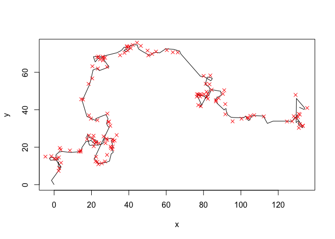
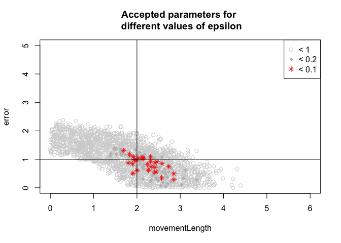

A movement model fit with ABC-Rejection and ABC-MCMC
===


The ABC rejection was originally proposed by Tavare, 1997. The ABC-MCMC was suggested by Marjoram, P.; Molitor, J.; Plagnol, V. & Tavare, S. (2003) Markov chain Monte Carlo without likelihoods. Proc. Natl. Acad. Sci. USA, 100, 15324-15328.

Code implemented by [Florian Hartig](http://florianhartig.wordpress.com/), following the pseudocode from [Hartig, F.; Calabrese, J. M.; Reineking, B.; Wiegand, T. & Huth, A. (2011) Statistical inference for stochastic simulation models - theory and application. Ecol. Lett., 14, 816-827.](http://onlinelibrary.wiley.com/doi/10.1111/j.1461-0248.2011.01640.x/suppinfo), supporting information. Reuse of this script is permitted under [CC-4.0 attribution share-alike](http://creativecommons.org/licenses/by-sa/4.0/) 

# The model 

## Process-model


```r
library(compiler)
model <- function(params=2, startvalues = c(0,0,0), steps = 200){
  x = startvalues[1]
  y = startvalues[2]
  direction = startvalues[3]
  
  movementLength = params[1]
  turningWidth = 1
  
  output = data.frame(x = rep(NA, steps+1), y = rep(NA, steps+1))
  output[1, ] = c(x,y)
  for (i in 1:steps){
    direction = direction + rnorm(1,0,turningWidth)
    length = rexp(1, 1/movementLength)
    x = x + sin(direction) * length
    y = y + cos(direction) * length
    output[i+1, ] = c(x,y)
  }
return(output)
}
model <- cmpfun(model)
```

Let's see what the model does


```r
data <- model()
plot(data, type = "l")
```

 

## Observation model

Assume we have recorded the test data. In fact, let's do it a bit harder. Assume we observe with error, and our measurement device has a problem - if the x-values have a digit larger than 0.7, we get an NA


```r
observationModel <- function(realData, sd=1){
  realData$xobs = rnorm(length(realData$x), mean = realData$x, sd = sd)
  realData$yobs = rnorm(length(realData$x), mean = realData$y, sd = sd)
  realData$xobs[realData$xobs - floor(realData$xobs) > 0.7 ] = NA
  return(realData)
}

obsdata <- observationModel(data)
plot(data, type = "l")
points(obsdata$xobs, obsdata$yobs, col = "red", pch = 4)
```

 


# Fitting the model

## Summary statistics


```r
summaryStatistics <- function(dat){
  meandisplacement = mean(sqrt(diff(dat$xobs)^2 + diff(dat$yobs)^2), na.rm = T)

  meandisplacement10 = mean(sqrt(diff(dat$xobs, lag = 2)^2 + diff(dat$yobs, lag = 2)^2), na.rm = T)/3
  
  #meanturning = mean(abs(diff(atan2(diff(dat$yobs),diff(dat$xobs)))), na.rm = T) 
  
  return(c(meandisplacement, meandisplacement10))
} 

dataSummary <- summaryStatistics(obsdata)
dataSummary
```

```
## [1] 2.803799 1.433168
```


## ABC rejection algorithm


```r
n = 10000
fit = data.frame(movementLength = runif(n, 0, 5), error = runif(n, 0,5), distance = rep(NA, n))

for (i in 1:n){
  simulatedPrediction <- model(fit[i,1])
  simulatedObservation<- observationModel(simulatedPrediction, fit[i,2])
  simulatedSummary <- summaryStatistics(simulatedObservation)
  simulatedSummary
  #deviation = max( simulatedSummary - dataSummary)
  deviation = sqrt(sum((simulatedSummary - dataSummary)^2))
  fit[i,3] = deviation
}
```

I had already calculated the euclidian distance between observed and simulated summaries. We now plot parameters for different acceptance intervals


```r
plot(fit[fit[,3] < 1, 1:2], xlim = c(0,6), ylim = c(0,5), col = "lightgrey", main = "Accepted parameters for \n different values of epsilon")
points(fit[fit[,3] < 0.2, 1:2],  pch = 18, col = "gray")
points(fit[fit[,3] < 0.1, 1:2],  pch = 8, col = "red")

legend("topright", c("< 1", "< 0.2", "< 0.1"), pch = c(1,18,8), col = c("lightgrey", "gray", "red"))

abline(v = 2)
abline(h = 1) 
```

 


## ABC-MCMC Algorithm


```r
n = 10000
fit = data.frame(movementLength = rep(NA, n), error = rep(NA, n), distance = rep(NA, n))


currentPar = c(2,0.9)
for (i in 1:n){
  newPar = rnorm(2,currentPar, sd = c(0.2,0.2))
  if (min(newPar) < 0 ) fit[i,] = c(currentPar, deviation)
  
  else{
    simulatedPrediction <- model(newPar[1])
    simulatedObservation<- observationModel(simulatedPrediction, newPar[2])
    simulatedSummary <- summaryStatistics(simulatedObservation)
    deviation = sqrt(sum( simulatedSummary - dataSummary)^2)
    
    if (deviation < 0.2){
      fit[i,] = c(newPar, deviation)
      currentPar = newPar
    } 
    else fit[i,] = c(currentPar, deviation)
  }
}
```


```r
plot(fit[, 1:2], xlim = c(0,6), ylim = c(0,5), col = "#00000022", main = "Accepted parameters for \n different values of epsilon")

abline(v = 2)
abline(h = 1) 
```

 

