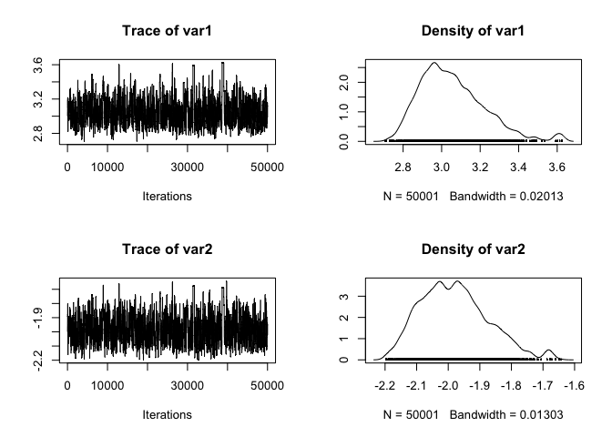
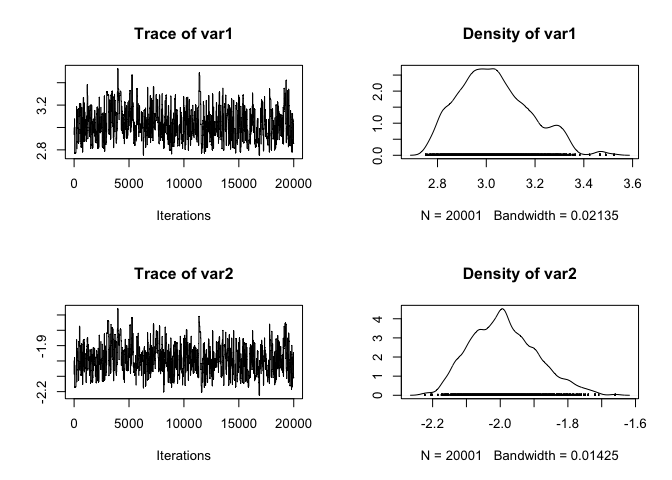

# ABC vs Synthetic Likelihoods
Florian Hartig  
30 Jul 2014  


### Introduction

In Hartig, F.; Calabrese, J. M.; Reineking, B.; Wiegand, T. & Huth, A. (2011) Statistical inference for stochastic simulation models - theory and application. Ecol. Lett., 14, 816-827, we classify two main competing methods for models via simulation-based likelihood approximation

1. Likelihood-approximations based on local, non-parametric approximations of the variance of the simulation outputs, particularly Approximate Bayesian Computation (ABC, Beaumont, M. A. (2010) Approximate Bayesian computation in evolution and ecology. Annu. Rev. Ecol. Evol. Syst., 41, 379-406.)

2. Likelihood-approximations based on parametric, typically global approximation of the simulation output such as Synthetic Likelihood, see Wood, S. N. (2010) Statistical inference for noisy nonlinear ecological dynamic systems. Nature, 466, 1102-1104. An example for fitting a stochastic forest gap model do data via this method is Hartig, F.; Dislich, C.; Wiegand, T. & Huth, A. (2014) Technical Note: Approximate Bayesian parameterization of a process-based tropical forest model. Biogeosciences, 11, 1261-1272.


### Example Data / Model


#### The model

Assume we have a stochastic model that we want to fit. It takes one parameter, and has an output of 10 values which happen to be around the mean of the parameter that we put in 


```r
stochasticModel <- function(par){
  if (par[2] + par[1] <= 0) return(rep(-9999,20))
  else return(rnorm(20, mean = (2.7*par[1] * par[2]), sd = par[2] + par[1] ))
}
```

#### Test data

Lets's create some data with known parameters


```r
data <- stochasticModel(c(3,-2))
```

#### Summary statistics 

We want to use ABC / synthetic likelihood to infer the parameters that were used. Both ABC and synthetic likelihoods require summary statistics, we use mean and sd of the data. 


```r
meandata <- mean(data)
standarddeviationdata <- sd(data)
```

### ABC-MCMC solution

Following Marjoram, P.; Molitor, J.; Plagnol, V. & Tavare, S. (2003) Markov chain Monte Carlo without likelihoods. Proc. Natl. Acad. Sci. USA, 100, 15324-15328, we plug the ABC acceptance into a standard metropolis hastings MCMC.
 
  

```r
library(coda)
```

```
## Warning: package 'coda' was built under R version 3.1.3
```

```r
run_MCMC_ABC <- function(startvalue, iterations){
 
    chain = array(dim = c(iterations+1,2))
    chain[1,] = startvalue
 
    for (i in 1:iterations){
         
        # proposalfunction
        proposal = rnorm(2,mean = chain[i,], sd= c(0.2,0.2))
        
        simulation <- stochasticModel(proposal)
 
        # comparison with the observed summary statistics
        diffmean <- abs(mean(simulation) - meandata)
        diffsd <- abs(sd(simulation) - standarddeviationdata)
          
        if((diffmean < 0.3) & (diffsd < 0.3)){
            chain[i+1,] = proposal
        }else{
            chain[i+1,] = chain[i,]
        }
    }
    return(mcmc(chain))
}
 
posterior <- run_MCMC_ABC(c(3,-2),50000)
plot(posterior)
```

 

### Synthetic likelihood

Following Wood, S. N. (2010) Statistical inference for noisy nonlinear ecological dynamic systems. Nature, 466, 1102-1104 and Hartig, F.; Dislich, C.; Wiegand, T. & Huth, A. (2014) Technical Note: Approximate Bayesian parameterization of a process-based tropical forest model. Biogeosciences, 11, 1261-1272, the synthetic likelihood approach is based on sampling a few times from the model, and approximating the likelihood by fitting a Gaussian distribution to the simulation outputs:


```r
run_MCMC_Synthetic <- function(startvalue, iterations){
 
    chain = array(dim = c(iterations+1,2))
    chain[1,] = startvalue
 
    for (i in 1:iterations){
         
        # proposalfunction
        proposal = rnorm(2,mean = chain[i,], sd= c(0.2,0.2))
        
        # simulate several model runs
        simualatedData <- matrix(NA, nrow = 100, ncol = 2)
        for (i in 1:100){
          simulation <- stochasticModel(c(3,-2))
          simualatedData[i,] <- c(mean(simulation) , sd(simulation))          
        }
        syntheticLikelihood1 <- fitdistr(simualatedData[1,], "normal")
        syntheticLikelihood2 <- fitdistr(simualatedData[2,], "normal")
        
        prob1 <- dnorm(meandata-syntheticLikelihood1$estimate[1], sd = syntheticLikelihood1$estimate[2], log = T)

        prob2 <- dnorm(standarddeviationdata-syntheticLikelihood2$estimate[1], sd = syntheticLikelihood2$estimate[2], log = T)
        
        if(prob < runif(1)){
            chain[i+1,] = proposal
        }else{
            chain[i+1,] = chain[i,]
        }
    }
    return(mcmc(chain))
}
 
posterior <- run_MCMC_ABC(c(3,-2),20000)
plot(posterior)
```

 


